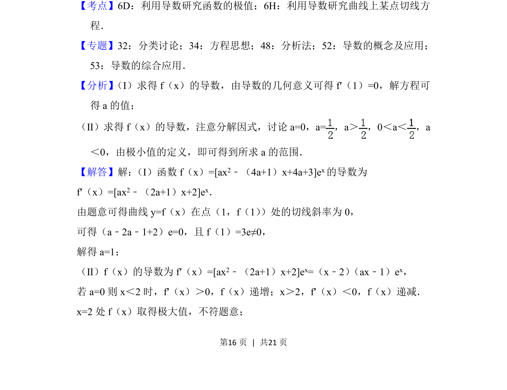
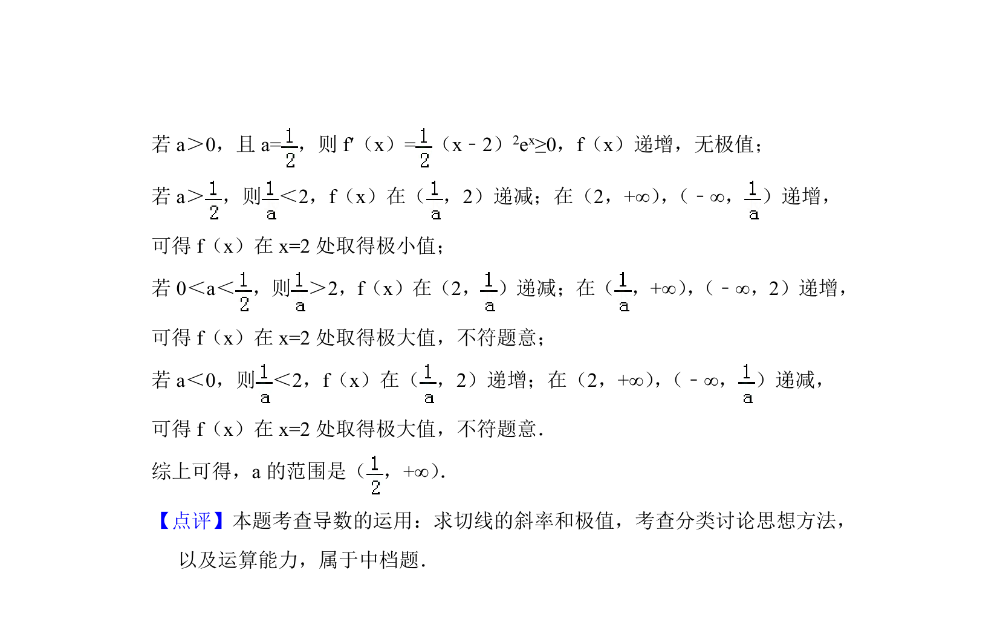

## 题面

## 摘要

本题考查利用导数求切线斜率及参数，以及通过导数讨论含参函数的极值条件。

## 关联考点

- [[710-利用导数研究曲线上某点切线方程|利用导数研究曲线上某点切线方程]]
- [[707-利用导数研究函数的极值|利用导数研究函数的极值]]
- [[424-参数分类讨论|分类讨论]]

## 答案与解析

> 📄 原 PDF 第 16 页：`素材/真题/北京/2008-2024·（北京）数学高考真题/2018年高考数学试卷（理）（北京）（解析卷）.pdf`
