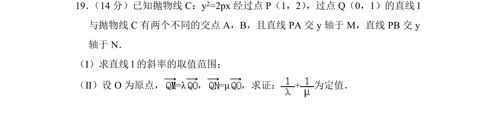
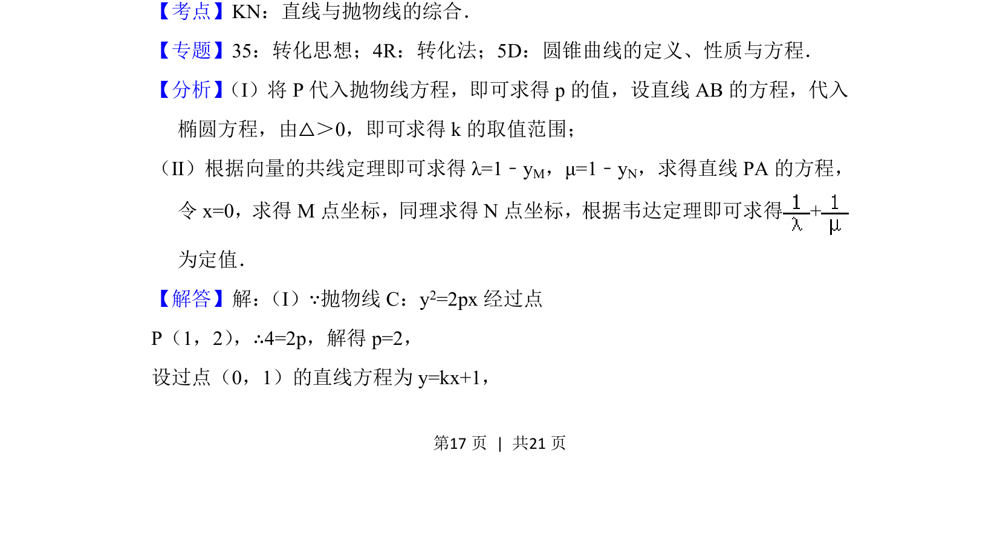
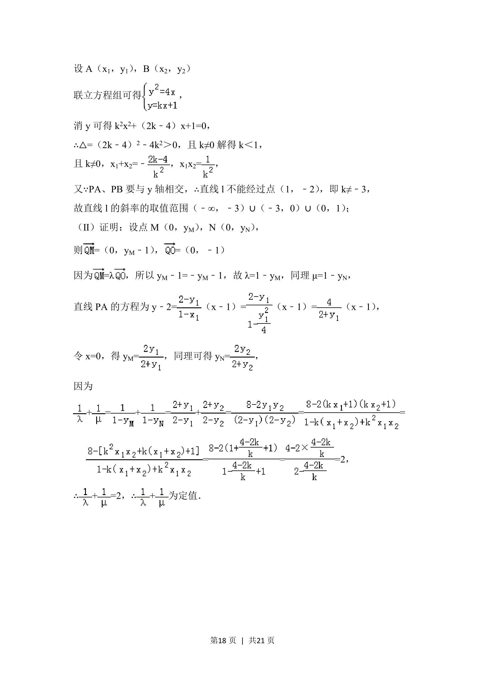
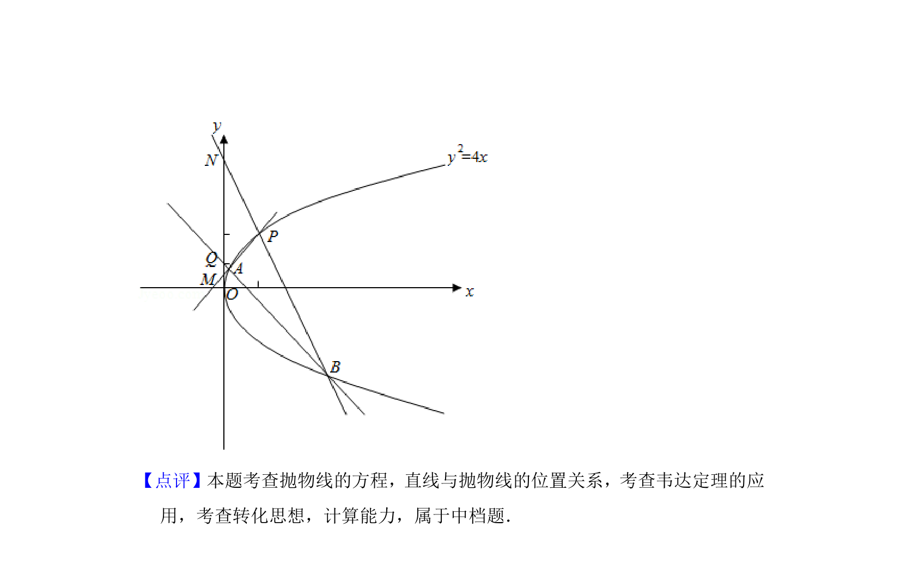

## 题面

## 摘要

本题考查抛物线方程、直线与抛物线相交、向量共线及定值证明。

## 关联考点

- [[直线与抛物线综合]]
- [[234-韦达定理-初中|韦达定理]]
- [[743-向量共线|向量共线]]
- [[377-定点定值问题|定值问题]]

## 答案与解析

> 📄 原 PDF 第 17 页：`素材/真题/北京/2008-2024·（北京）数学高考真题/2018年高考数学试卷（理）（北京）（解析卷）.pdf`
