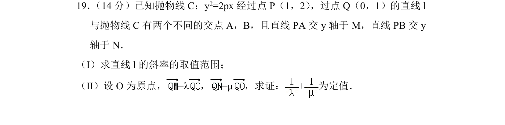
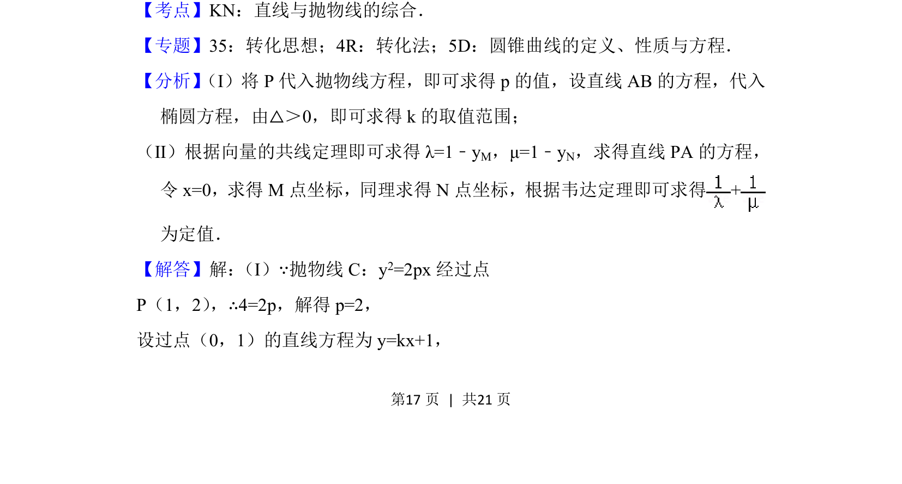
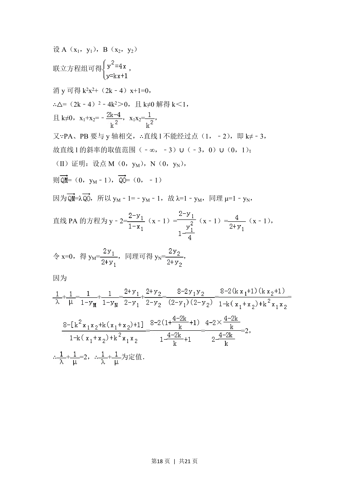
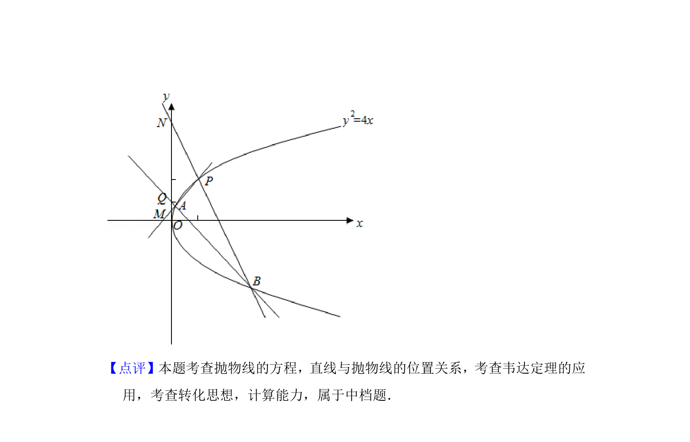

## 题面

## 摘要

本题考查抛物线方程、直线与抛物线相交、向量共线及定值证明。

## 关联考点

- [[直线与抛物线综合]]
- [[234-韦达定理-初中|韦达定理]]
- [[743-向量共线|向量共线]]
- [[377-定点定值问题|定值问题]]

## 答案与解析

> 📄 原 PDF 第 17 页：`素材/真题/北京/2008-2024·（北京）数学高考真题/2018年高考数学试卷（理）（北京）（解析卷）.pdf`

<!-- 题干文本-start -->
## 题干文本
19． （14分）已知抛物线C：y2=2px经过点P（1，2） ，过点Q（0，1）的直线l
与抛物线C有两个不同的交点A，B，且直线PA交y轴于M，直线PB交y
轴于N．
（Ⅰ）求直线l的斜率的取值范围；
（Ⅱ）设O为原点，=λ，=μ，求证：+为定值．
<!-- 题干文本-end -->

<!-- 解析文本-start -->
## 解析文本
【考点】KN：直线与抛物线的综合．菁优网版权所有
【专题】35：转化思想；4R：转化法；5D：圆锥曲线的定义、性质与方程．
【分析】 （Ⅰ）将P代入抛物线方程，即可求得p的值，设直线AB的方程，代入
椭圆方程，由△＞0，即可求得k的取值范围；
（Ⅱ）根据向量的共线定理即可求得λ=1﹣y M，μ=1﹣yN，求得直线PA的方程，
令x=0，求得M点坐标，同理求得N点坐标，根据韦达定理即可求得+
为定值．
【解答】解： （Ⅰ）∵抛物线C：y2=2px经过点
P（1，2） ，∴4=2p，解得p=2，
设过点（0，1）的直线方程为y=kx+1，
<!-- 解析文本-end -->
