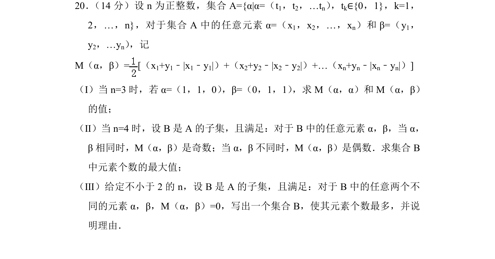
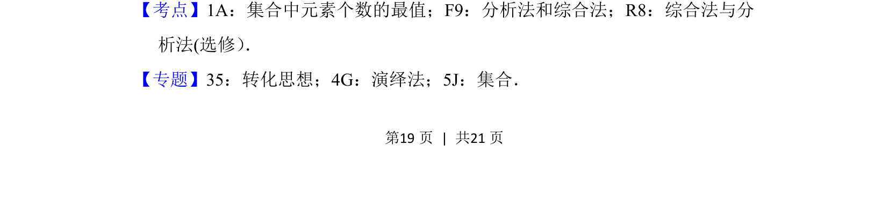
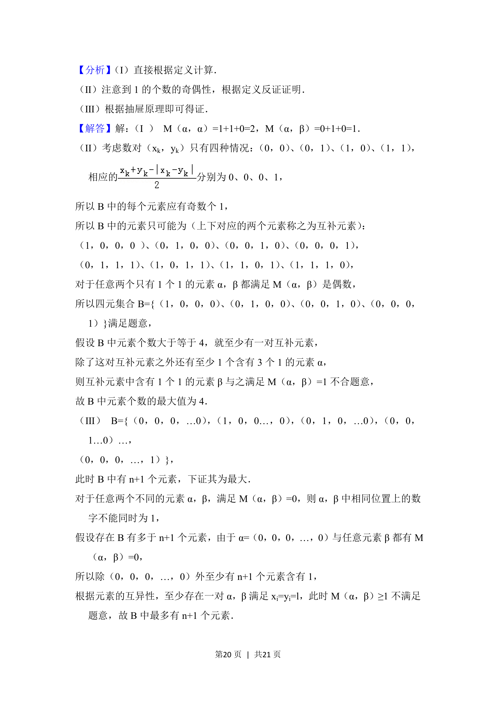
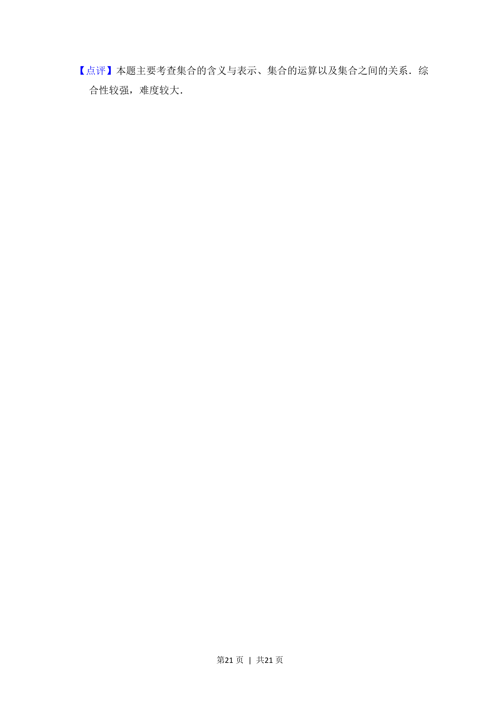

## 题面

## 摘要

该题通过新定义运算M(α,β)研究在特定奇偶性或零值约束下集合B中元素个数的最大值，涉及分析归纳与反证法。

## 关联考点

- [[集合中元素个数的最值]]
- [[分析法和综合法]]
- [[综合法与分析法]]

## 答案与解析

> 📄 原 PDF 第 19 页：`素材/真题/北京/2008-2024·（北京）数学高考真题/2018年高考数学试卷（理）（北京）（解析卷）.pdf`
