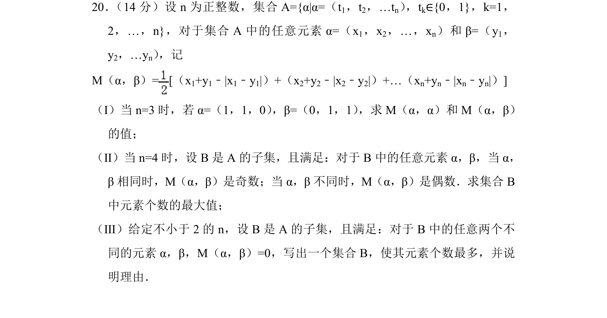
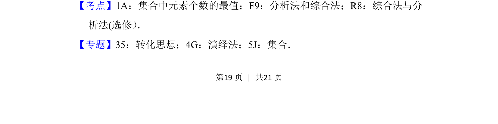
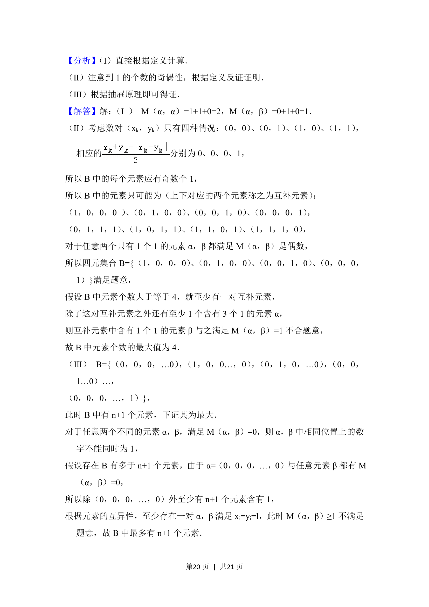
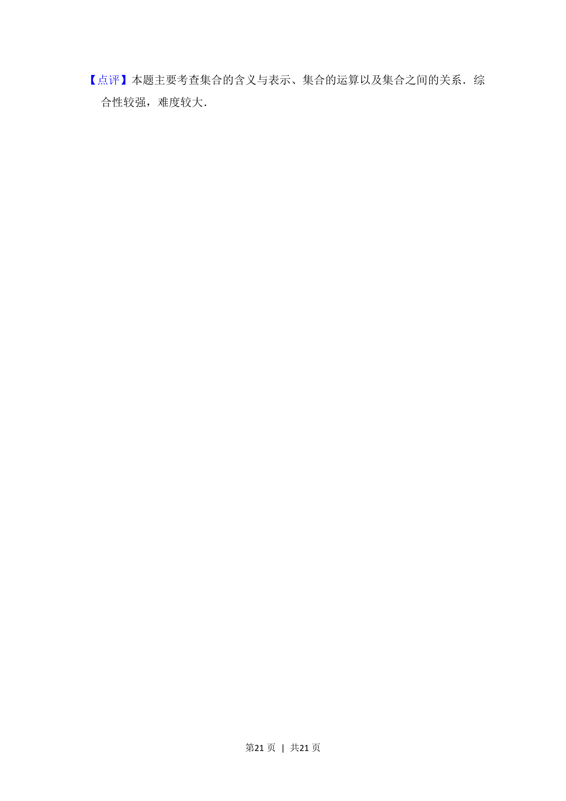

## 题面

## 摘要

该题通过新定义运算M(α,β)研究在特定奇偶性或零值约束下集合B中元素个数的最大值，涉及分析归纳与反证法。

## 关联考点

- [[集合中元素个数的最值]]
- [[分析法和综合法]]
- [[综合法与分析法]]

## 答案与解析

> 📄 原 PDF 第 19 页：`素材/真题/北京/2008-2024·（北京）数学高考真题/2018年高考数学试卷（理）（北京）（解析卷）.pdf`

<!-- 题干文本-start -->
## 题干文本
20． （14分）设n为正整数，集合A={α|α=（t 1，t2，…tn） ，tk∈{0，1}，k=1，
2，…，n}，对于集合A中的任意元素α=（x 1，x2，…，x n）和β=（y 1，
y2，…yn） ，记
M（α，β）= [（x 1+y1﹣|x1﹣y1|）+（x2+y2﹣|x2﹣y2|）+…（xn+yn﹣|xn﹣yn|）]
（Ⅰ）当n=3时，若α=（1，1，0） ，β=（0，1，1） ，求M（α，α）和M（α，β）
的值；
（Ⅱ）当n=4时，设B是A的子集，且满足：对于B中的任意元素α，β，当α，
β相同时，M（α，β）是奇数；当α，β不同时，M（α，β）是偶数．求集合B
中元素个数的最大值；
（Ⅲ）给定不小于2的n，设B是A的子集，且满足：对于B中的任意两个不
同的元素α，β，M（α，β）=0，写出一个集合B，使其元素个数最多，并说
明理由．
<!-- 题干文本-end -->

<!-- 解析文本-start -->
## 解析文本
【考点】1A：集合中元素个数的最值；F9：分析法和综合法；R8：综合法与分
析法(选修） ．菁优网版权所有
【专题】35：转化思想；4G：演绎法；5J：集合．
<!-- 解析文本-end -->
