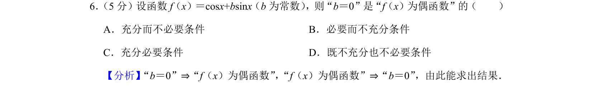
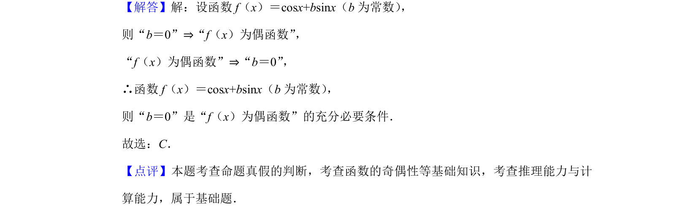

## 题面

## 摘要

考查函数奇偶性定义及充分必要条件的判断，通过参数b讨论余弦与正弦组合函数的性质。

## 关联考点

- [[533-充分必要条件|充分必要条件]]
- [[679-函数奇偶性|函数奇偶性]]
- [[270-三角函数应用|三角函数]]

## 答案与解析

> 📄 原 PDF 第 3 页：`素材/真题/北京/2008-2024·（北京）数学高考真题/2019年高考数学试卷（文）（北京）（解析卷）.pdf`
