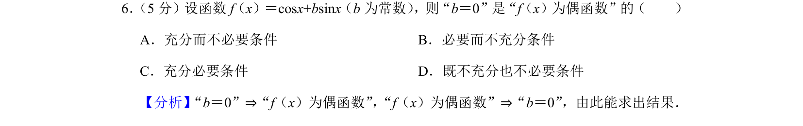
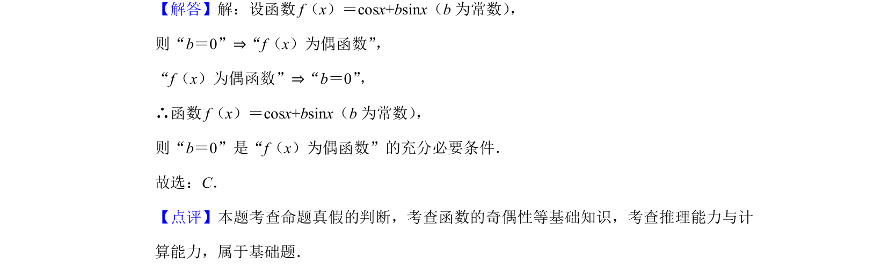

## 题面

## 摘要

考查函数奇偶性定义及充分必要条件的判断，通过参数b讨论余弦与正弦组合函数的性质。

## 关联考点

- [[533-充分必要条件|充分必要条件]]
- [[284-函数的奇偶性|函数奇偶性]]
- [[270-三角函数应用|三角函数]]

## 答案与解析

> 📄 原 PDF 第 3 页：`素材/真题/北京/2008-2024·（北京）数学高考真题/2019年高考数学试卷（文）（北京）（解析卷）.pdf`

<!-- 题干文本-start -->
## 题干文本
6． （5分）设函数f（x）＝cosx+bsinx（b为常数） ，则“b＝0”是“f（x）为偶函数”的（　　）
A．充分而不必要条件B．必要而不充分条件
C．充分必要条件D．既不充分也不必要条件
<!-- 题干文本-end -->

<!-- 解析文本-start -->
## 解析文本
【分析】“b＝0”⇒“f（x）为偶函数”，“f（x）为偶函数”⇒“b＝0”，由此能求出结果．
【解答】解：设函数f（x）＝cosx+bsinx（b为常数） ，
则“b＝0”⇒“f（x）为偶函数”，
“f（x）为偶函数”⇒“b＝0”，
∴函数f（x）＝cosx+bsinx（b为常数） ，
则“b＝0”是“f（x）为偶函数”的充分必要条件．
故选：C．
【点评】本题考查命题真假的判断，考查函数的奇偶性等基础知识，考查推理能力与计
算能力，属于基础题．
<!-- 解析文本-end -->
