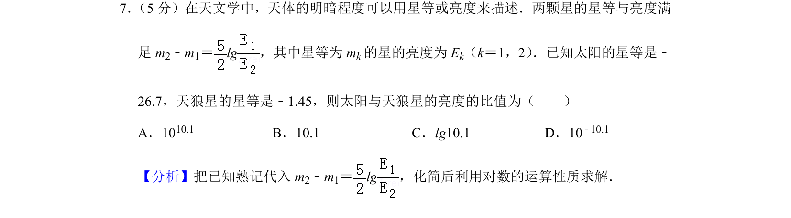
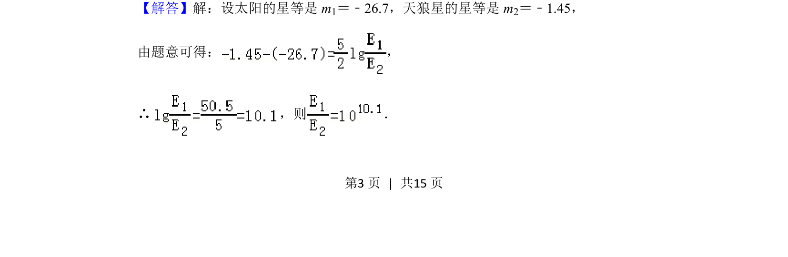

## 题面

## 摘要

把已知星等代入公式，利用对数运算性质求解亮度的比值。

## 关联考点

- [[301-对数运算性质|对数运算性质]]
- [[指数式与对数式互化]]
- [[1265-函数模型及其应用|数学建模]]

## 答案与解析

> 📄 原 PDF 第 3 页：`素材/真题/北京/2008-2024·（北京）数学高考真题/2019年高考数学试卷（文）（北京）（解析卷）.pdf`
