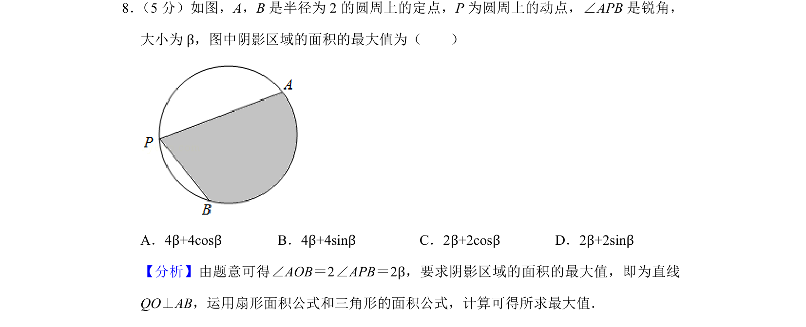
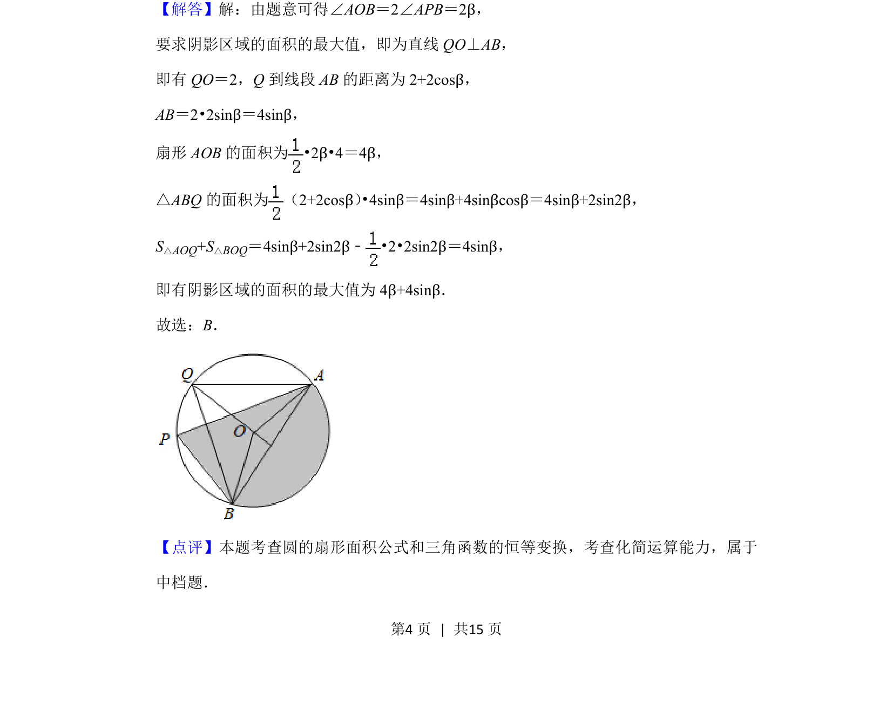

## 题面

## 摘要

本题通过圆周上定点与动点构成的阴影区域，考查扇形面积与三角形面积计算及三角函数恒等变换求最值。

## 关联考点

- [[226-扇形面积公式|扇形面积公式]]
- [[619-三角形面积公式|三角形面积公式]]
- [[1248-三角函数恒等变换|三角函数恒等变换]]
- [[286-函数的最值|最值]]

## 答案与解析

> 📄 原 PDF 第 4 页：`素材/真题/北京/2008-2024·（北京）数学高考真题/2019年高考数学试卷（文）（北京）（解析卷）.pdf`
