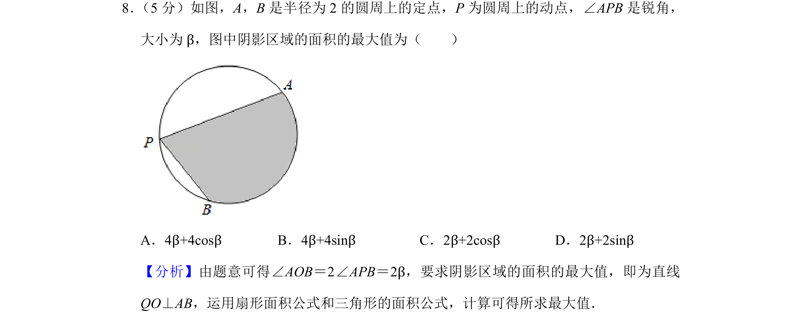
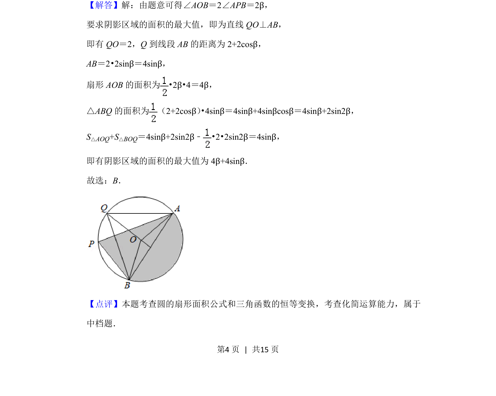
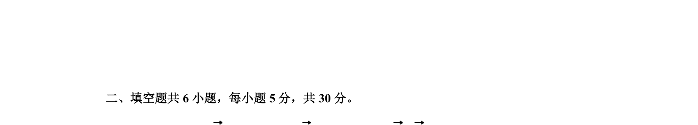

## 题面

## 摘要

本题通过圆周上定点与动点构成的阴影区域，考查扇形面积与三角形面积计算及三角函数恒等变换求最值。

## 关联考点

- [[226-扇形面积公式|扇形面积公式]]
- [[619-三角形面积公式|三角形面积公式]]
- [[1248-三角函数恒等变换|三角函数恒等变换]]
- [[286-函数的最值|最值]]

## 答案与解析

> 📄 原 PDF 第 4 页：`素材/真题/北京/2008-2024·（北京）数学高考真题/2019年高考数学试卷（文）（北京）（解析卷）.pdf`

<!-- 题干文本-start -->
## 题干文本
8． （5分）如图，A，B是半径为2的圆周上的定点，P为圆周上的动点，∠APB是锐角，
大小为β，图中阴影区域的面积的最大值为（　　）
A．4β+4cosβB．4β+4sinβC．2β+2cosβD．2β+2sinβ
<!-- 题干文本-end -->

<!-- 解析文本-start -->
## 解析文本
【分析】由题意可得∠AOB＝2∠APB＝2β，要求阴影区域的面积的最大值，即为直线
QO⊥AB，运用扇形面积公式和三角形的面积公式，计算可得所求最大值．
【解答】解：由题意可得∠AOB＝2∠APB＝2β，
要求阴影区域的面积的最大值，即为直线QO⊥AB，
即有QO＝2，Q到线段AB的距离为2+2cosβ，
AB＝2•2sinβ＝4sinβ，
扇形AOB的面积为•2β•4＝4β，
△ABQ的面积为 （2+2cosβ）•4sinβ＝4sinβ+4sinβcosβ＝4sinβ+2sin2β，
S△AOQ+S△BOQ＝4sinβ+2sin2β﹣•2•2sin2β＝4sinβ，
即有阴影区域的面积的最大值为4β+4sinβ．
故选：B．
【点评】本题考查圆的扇形面积公式和三角函数的恒等变换，考查化简运算能力，属于
中档题．
<!-- 解析文本-end -->
