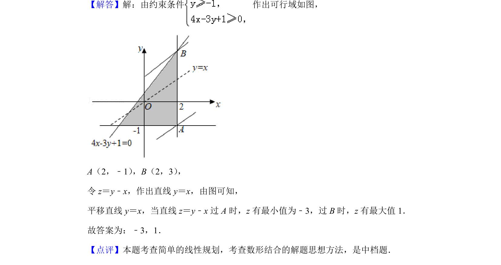

## 题面

## 摘要

线性规划中根据约束条件求目标函数最值

## 关联考点

- [[1156-可行域|可行域]]
- [[线性目标函数]]
- [[897-数形结合|数形结合]]
- [[286-函数的最值|最值]]

## 答案与解析

> 📄 原 PDF 第 5 页：`素材/真题/北京/2008-2024·（北京）数学高考真题/2019年高考数学试卷（文）（北京）（解析卷）.pdf`
