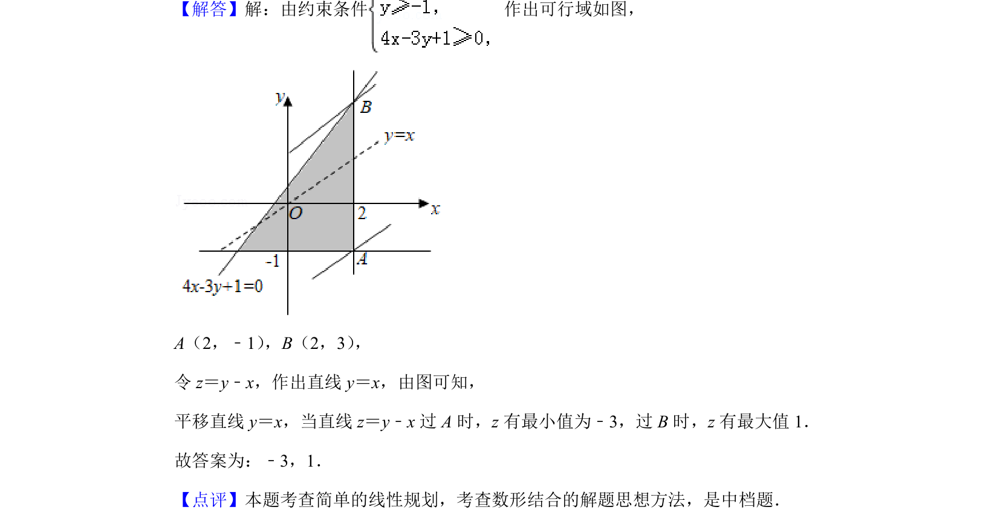

## 题面

## 摘要

线性规划中根据约束条件求目标函数最值

## 关联考点

- [[1156-可行域|可行域]]
- [[线性目标函数]]
- [[897-数形结合|数形结合]]
- [[286-函数的最值|最值]]

## 答案与解析

> 📄 原 PDF 第 5 页：`素材/真题/北京/2008-2024·（北京）数学高考真题/2019年高考数学试卷（文）（北京）（解析卷）.pdf`

<!-- 题干文本-start -->
## 题干文本
10． （5分）若x，y满足 则y﹣x的最小值为　﹣3　，最大值为　1　．
<!-- 题干文本-end -->

<!-- 解析文本-start -->
## 解析文本
【分析】由约束条件作出可行域，令z＝y﹣x，作出直线y＝x，平移直线得答案．
【解答】解：由约束条件 作出可行域如图，
A（2，﹣1） ，B（2，3） ，
令z＝y﹣x，作出直线y＝x，由图可知，
平移直线y＝x，当直线z＝y﹣x过A时，z有最小值为﹣3，过B时，z有最大值1．
故答案为：﹣3，1．
【点评】本题考查简单的线性规划，考查数形结合的解题思想方法，是中档题．
<!-- 解析文本-end -->
