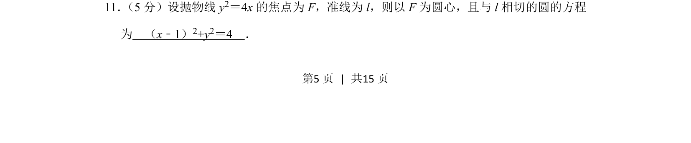
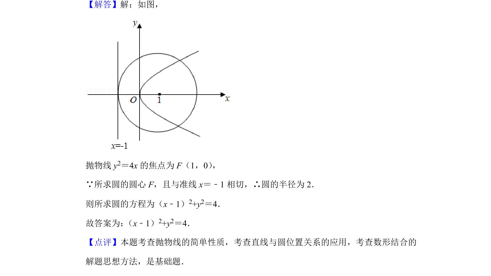

## 题面

## 摘要

根据抛物线方程求焦点和准线，结合圆心和与准线相切求圆的方程。

## 关联考点

- [[878-抛物线的几何性质|抛物线的几何性质]]
- [[782-圆的方程|圆的方程]]
- [[1005-直线与圆相切|直线与圆相切]]

## 答案与解析

> 📄 原 PDF 第 5 页：`素材/真题/北京/2008-2024·（北京）数学高考真题/2019年高考数学试卷（文）（北京）（解析卷）.pdf`
