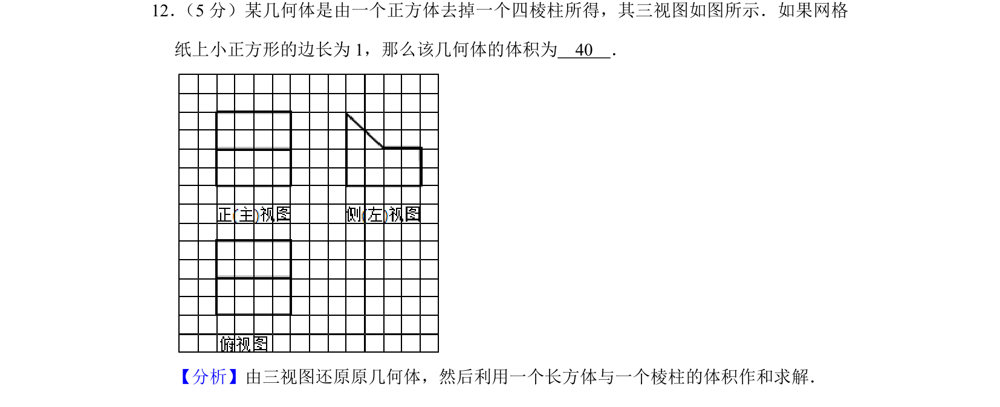
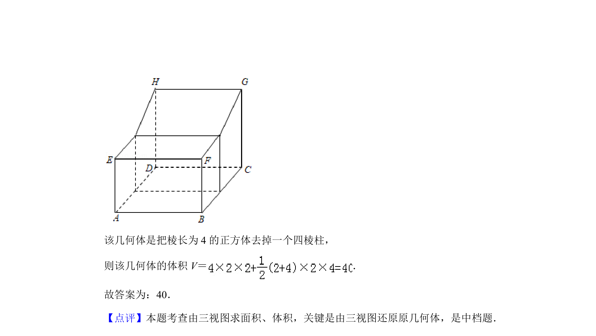

## 题面

## 摘要

由三视图还原正方体切去四棱柱后的几何体，利用割补法求组合体体积。

## 关联考点

- [[1057-立体图形还原|三视图还原几何体]]
- [[1394-组合体体积|组合体体积]]
- [[714-割补法|割补法]]

## 答案与解析

> 📄 原 PDF 第 6 页：`素材/真题/北京/2008-2024·（北京）数学高考真题/2019年高考数学试卷（文）（北京）（解析卷）.pdf`
