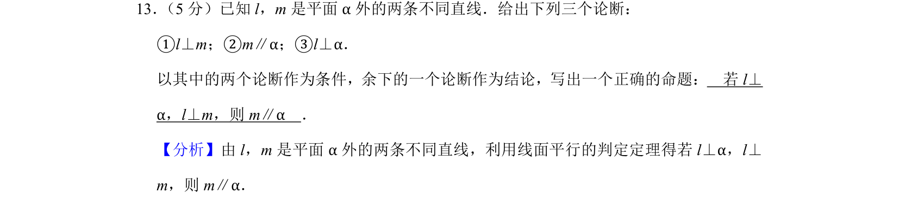
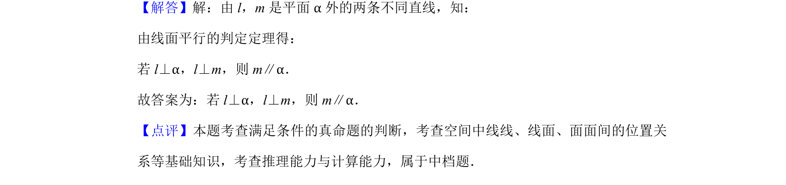

## 题面

## 摘要

考查空间线面位置关系及命题构造，要求用给定论断组成正确命题。

## 关联考点

- [[1400-线面平行的判定|线面平行的判定]]
- [[线面垂直的性质]]
- [[空间位置关系推理]]

## 答案与解析

> 📄 原 PDF 第 7 页：`素材/真题/北京/2008-2024·（北京）数学高考真题/2019年高考数学试卷（文）（北京）（解析卷）.pdf`
