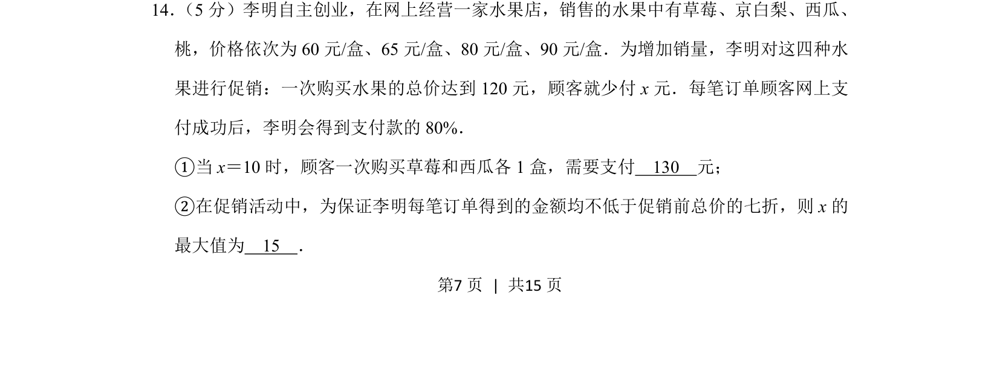
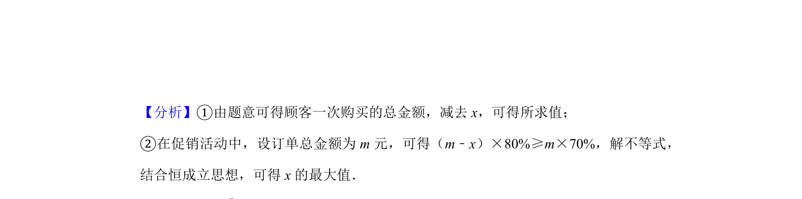
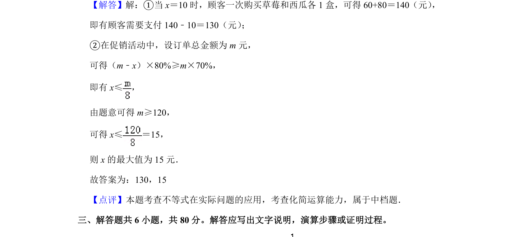

## 题面

## 摘要

考查分段函数与一次不等式在实际促销问题中的应用，求支付金额与参数最值。

## 关联考点

- [[分段函数模型]]
- [[114-一元一次不等式|一元一次不等式]]
- [[914-最值问题|最值问题]]

## 答案与解析

> 📄 原 PDF 第 7 页：`素材/真题/北京/2008-2024·（北京）数学高考真题/2019年高考数学试卷（文）（北京）（解析卷）.pdf`
