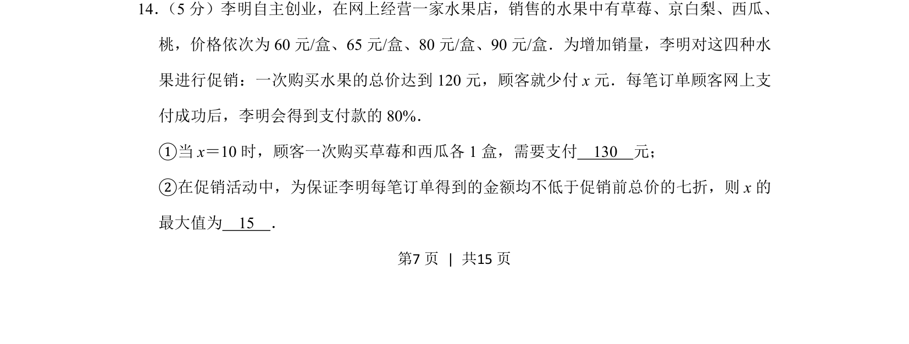
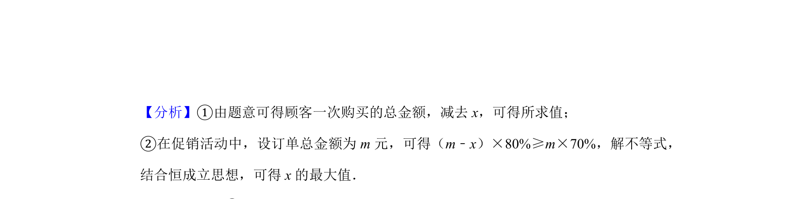
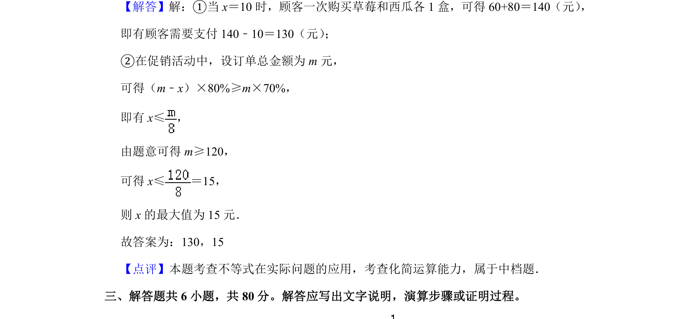

## 题面

## 摘要

考查分段函数与一次不等式在实际促销问题中的应用，求支付金额与参数最值。

## 关联考点

- [[1369-分段函数模型|分段函数模型]]
- [[114-一元一次不等式|一元一次不等式]]
- [[913-最值问题|最值问题]]

## 答案与解析

> 📄 原 PDF 第 7 页：`素材/真题/北京/2008-2024·（北京）数学高考真题/2019年高考数学试卷（文）（北京）（解析卷）.pdf`

<!-- 题干文本-start -->
## 题干文本
14． （5分）李明自主创业，在网上经营一家水果店，销售的水果中有草莓、京白梨、西瓜、
桃，价格依次为60元/盒、65元/盒、80元/盒、90元/盒．为增加销量，李明对这四种水
果进行促销：一次购买水果的总价达到120元，顾客就少付x元．每笔订单顾客网上支
付成功后，李明会得到支付款的80%．
①当x＝10时，顾客一次购买草莓和西瓜各1盒，需要支付　130　元；
②在促销活动中，为保证李明每笔订单得到的金额均不低于促销前总价的七折，则x的
最大值为　15　．
<!-- 题干文本-end -->

<!-- 解析文本-start -->
## 解析文本

<!-- 解析文本-end -->
