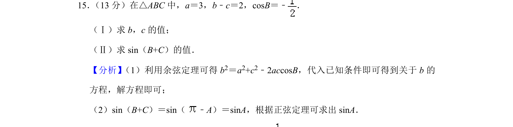
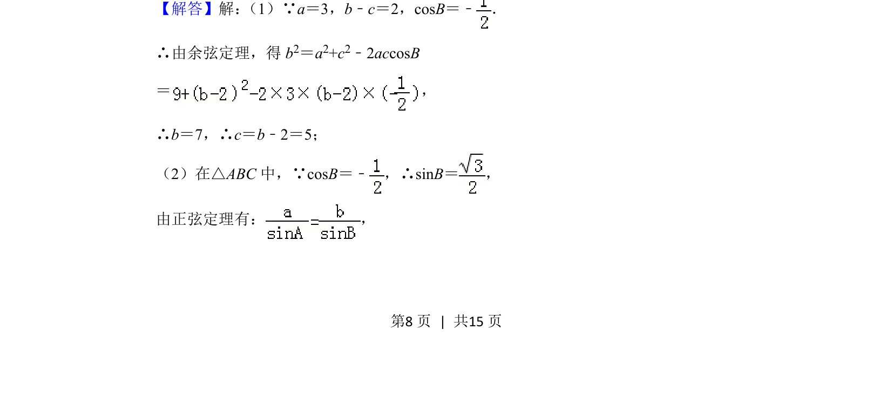
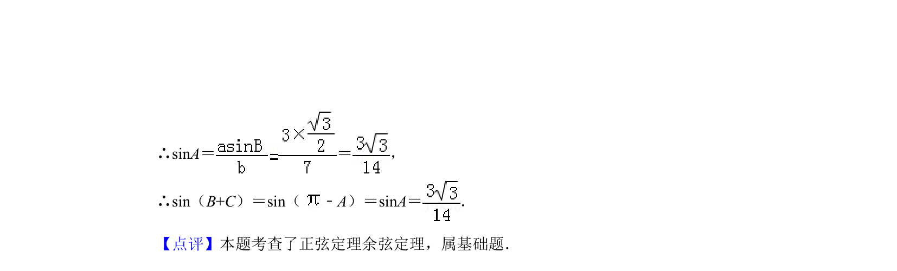

## 题面

## 摘要

在三角形中应用余弦定理求边，再用正弦定理及诱导公式求正弦值

## 关联考点

- [[126-定理|余弦定理]]
- [[126-定理|正弦定理]]
- [[1249-三角函数的诱导公式|诱导公式]]

## 答案与解析

> 📄 原 PDF 第 8 页：`素材/真题/北京/2008-2024·（北京）数学高考真题/2019年高考数学试卷（文）（北京）（解析卷）.pdf`
