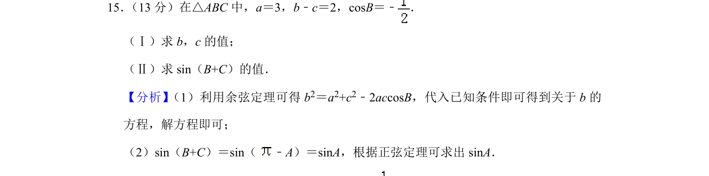
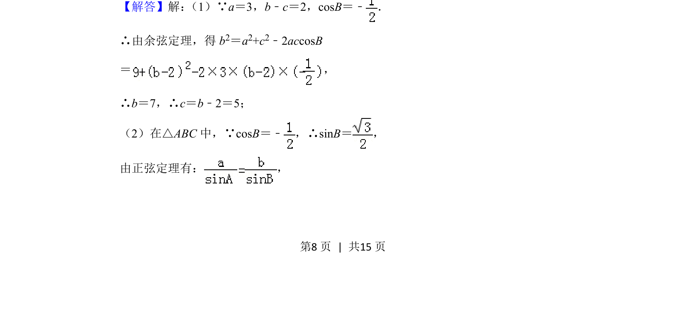
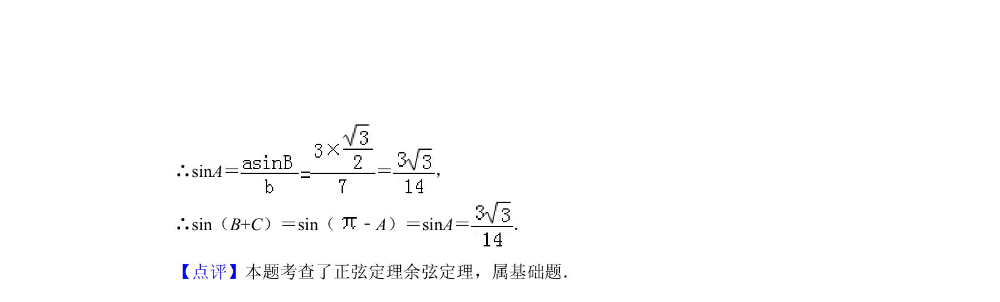

## 题面

## 摘要

在三角形中应用余弦定理求边，再用正弦定理及诱导公式求正弦值

## 关联考点

- [[126-定理|余弦定理]]
- [[126-定理|正弦定理]]
- [[1249-三角函数的诱导公式|诱导公式]]

## 答案与解析

> 📄 原 PDF 第 8 页：`素材/真题/北京/2008-2024·（北京）数学高考真题/2019年高考数学试卷（文）（北京）（解析卷）.pdf`

<!-- 题干文本-start -->
## 题干文本
15． （13分）在△ABC中，a＝3，b﹣c＝2，cosB＝﹣ ．
（Ⅰ）求b，c的值；
（Ⅱ）求sin（B+C）的值．
<!-- 题干文本-end -->

<!-- 解析文本-start -->
## 解析文本
【分析】 （1）利用余弦定理可得b2＝a2+c2﹣2accosB，代入已知条件即可得到关于b的
方程，解方程即可；
（2）sin（B+C）＝sin（ ﹣A）＝sinA，根据正弦定理可求出sinA．
【解答】解： （1）∵a＝3，b﹣c＝2，cosB＝﹣ ．
∴由余弦定理，得b 2＝a2+c2﹣2accosB
＝ ，
∴b＝7，∴c＝b﹣2＝5；
（2）在△ABC中，∵cosB＝﹣ ，∴sinB＝ ，
由正弦定理有： ，
<!-- 解析文本-end -->
