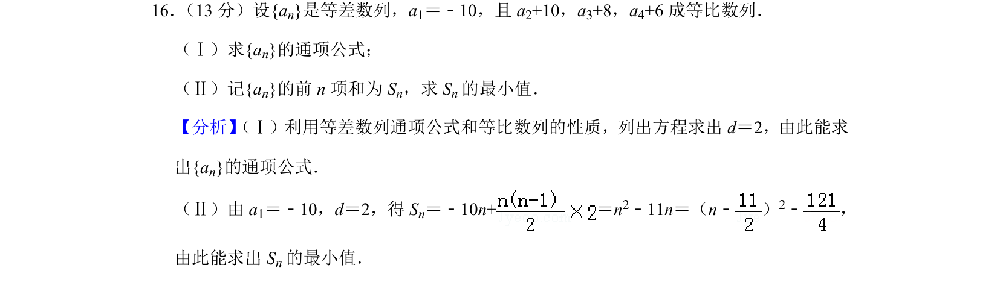
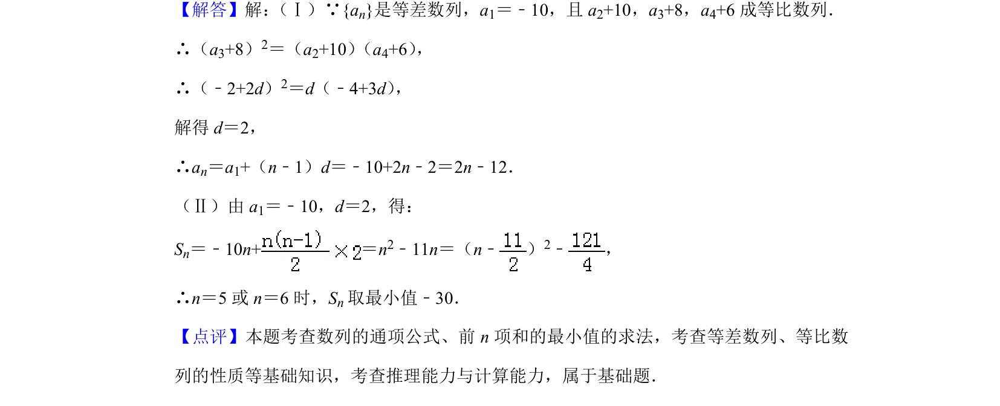

## 题面

## 摘要

等差数列通项与等比中项结合求参数，并通过二次函数求前n项和最小值。

## 关联考点

- [[356-等差数列概念|等差数列]]
- [[1067-等比数列的定义与通项公式|等比数列]]
- [[640-二次函数最值|二次函数最值]]
- [[355-等差数列前n项和|等差数列前n项和]]

## 答案与解析

> 📄 原 PDF 第 9 页：`素材/真题/北京/2008-2024·（北京）数学高考真题/2019年高考数学试卷（文）（北京）（解析卷）.pdf`
