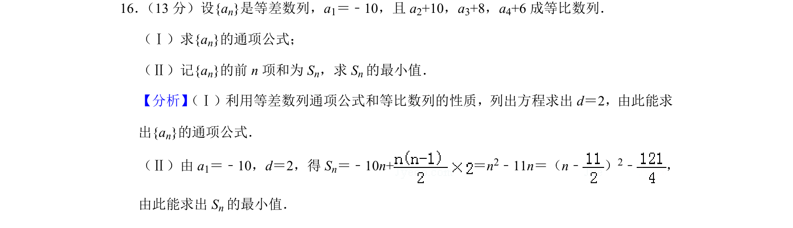
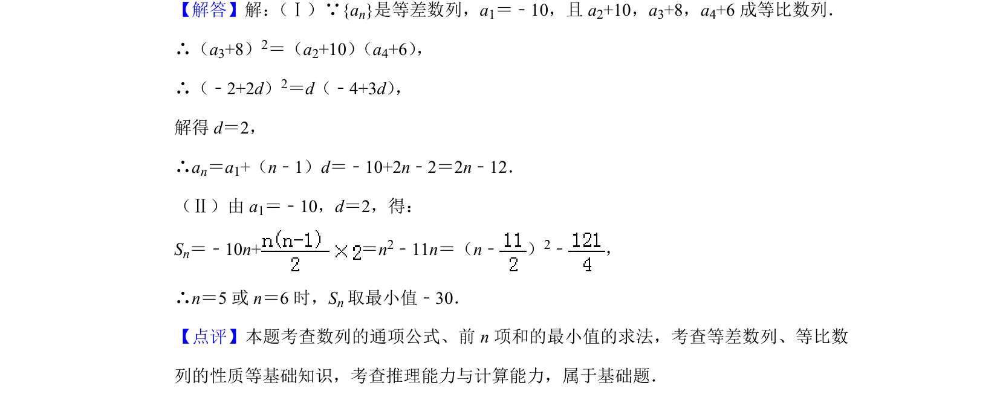

## 题面

## 摘要

等差数列通项与等比中项结合求参数，并通过二次函数求前n项和最小值。

## 关联考点

- [[356-等差数列概念|等差数列]]
- [[1067-等比数列的定义与通项公式|等比数列]]
- [[640-二次函数最值|二次函数最值]]
- [[355-等差数列前n项和|等差数列前n项和]]

## 答案与解析

> 📄 原 PDF 第 9 页：`素材/真题/北京/2008-2024·（北京）数学高考真题/2019年高考数学试卷（文）（北京）（解析卷）.pdf`

<!-- 题干文本-start -->
## 题干文本
16． （13分）设{an}是等差数列，a1＝﹣10，且a 2+10，a3+8，a4+6成等比数列．
（Ⅰ）求{an}的通项公式；
（Ⅱ）记{an}的前n项和为S n，求S n的最小值．
<!-- 题干文本-end -->

<!-- 解析文本-start -->
## 解析文本
【分析】 （Ⅰ）利用等差数列通项公式和等比数列的性质，列出方程求出d＝2，由此能求
出{an}的通项公式．
（Ⅱ）由a 1＝﹣10，d＝2，得S n＝﹣10n+＝n 2﹣11n＝（n﹣ ） 2﹣ ，
由此能求出S n的最小值．
【解答】解： （Ⅰ）∵{an}是等差数列，a1＝﹣10，且a 2+10，a3+8，a4+6成等比数列．
∴（a3+8）2＝（a2+10） （a4+6） ，
∴（﹣2+2d）2＝d（﹣4+3d） ，
解得d＝2，
∴an＝a1+（n﹣1）d＝﹣10+2n﹣2＝2n﹣12．
（Ⅱ）由a 1＝﹣10，d＝2，得：
Sn＝﹣10n+＝n 2﹣11n＝（n﹣ ） 2﹣ ，
∴n＝5或n＝6时，S n取最小值﹣30．
【点评】本题考查数列的通项公式、前n项和的最小值的求法，考查等差数列、等比数
列的性质等基础知识，考查推理能力与计算能力，属于基础题．
<!-- 解析文本-end -->
