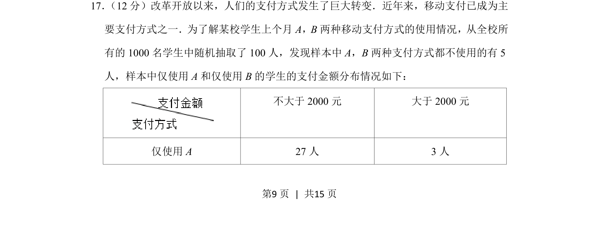
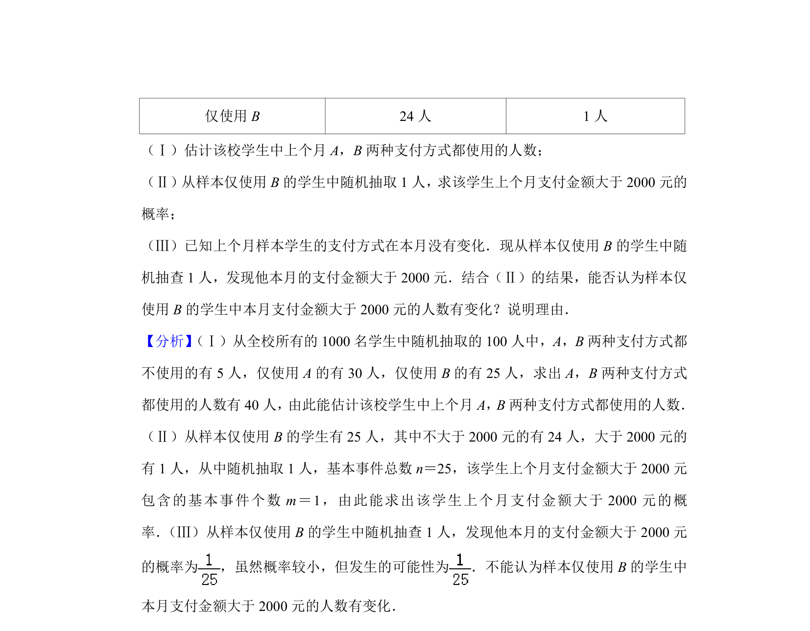
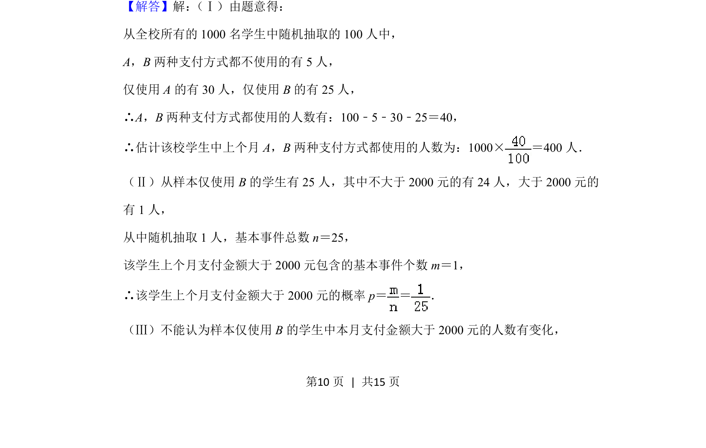
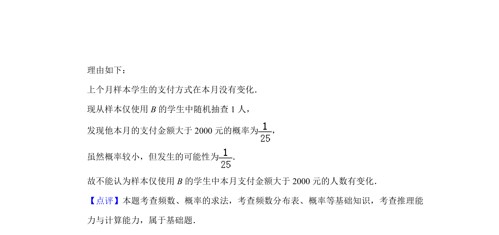

## 题面

## 摘要

统计抽样调查，用样本频率分布推测总体分布及相关概率计算。

## 关联考点

- [[141-统计图|统计]]
- [[143-频数分布|频率分布]]
- [[1401-总体估计|总体估计]]
- [[948-概率计算|概率计算]]

## 答案与解析

> 📄 原 PDF 第 9 页：`素材/真题/北京/2008-2024·（北京）数学高考真题/2019年高考数学试卷（文）（北京）（解析卷）.pdf`
