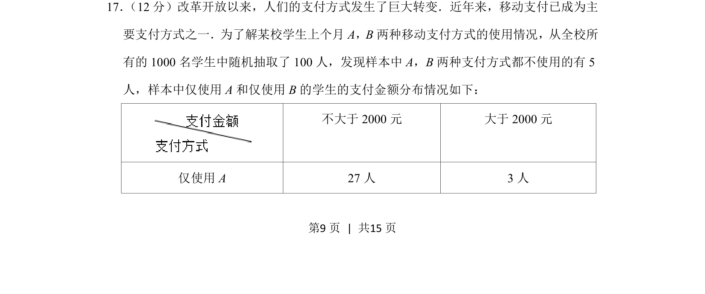
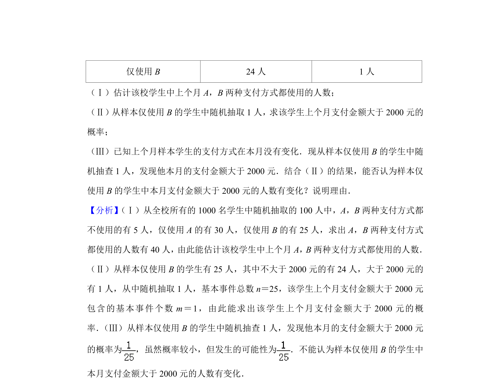
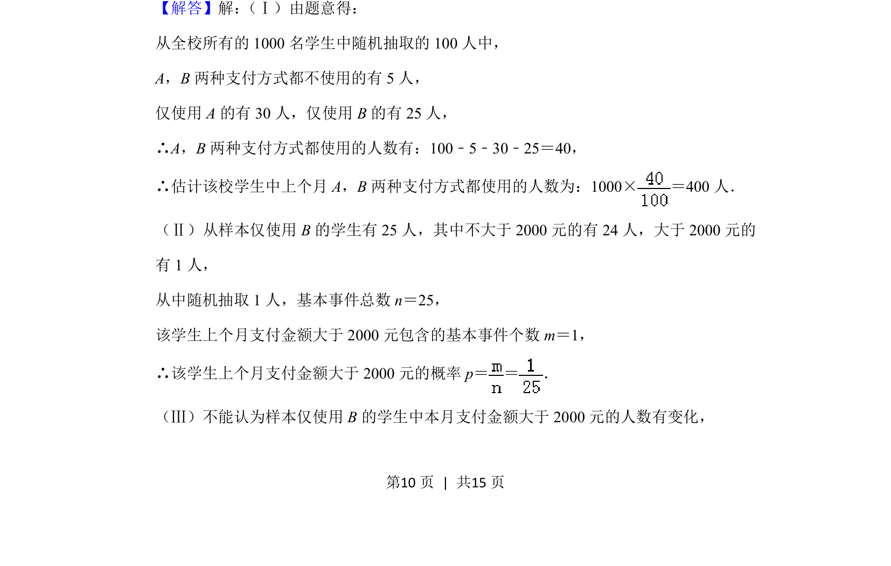
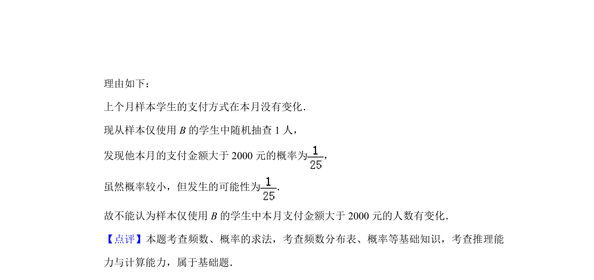

## 题面

## 摘要

统计抽样调查，用样本频率分布推测总体分布及相关概率计算。

## 关联考点

- [[141-统计图|统计]]
- [[143-频数分布|频率分布]]
- [[1401-总体估计|总体估计]]
- [[948-概率计算|概率计算]]

## 答案与解析

> 📄 原 PDF 第 9 页：`素材/真题/北京/2008-2024·（北京）数学高考真题/2019年高考数学试卷（文）（北京）（解析卷）.pdf`

<!-- 题干文本-start -->
## 题干文本
17． （12分）改革开放以来，人们的支付方式发生了巨大转变．近年来，移动支付已成为主
要支付方式之一．为了解某校学生上个月A，B两种移动支付方式的使用情况，从全校所
有的1000名学生中随机抽取了100人，发现样本中A，B两种支付方式都不使用的有5
人，样本中仅使用A和仅使用B的学生的支付金额分布情况如下：
不大于2000元 大于2000元
仅使用A 27人 3人
<!-- 题干文本-end -->

<!-- 解析文本-start -->
## 解析文本

<!-- 解析文本-end -->
