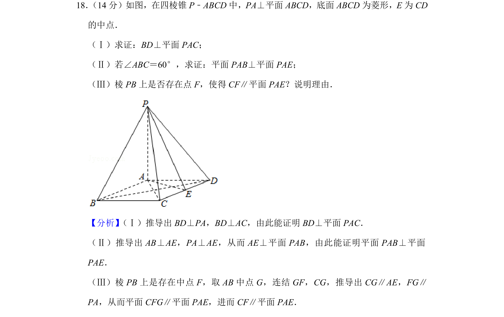
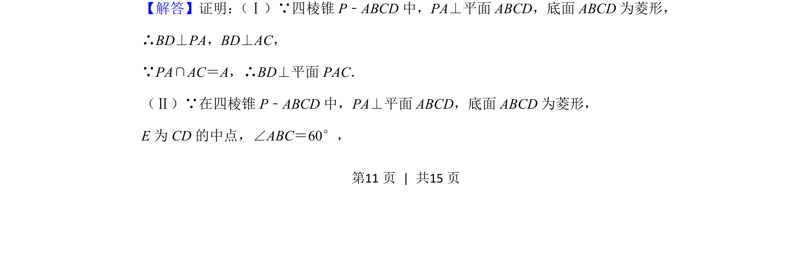
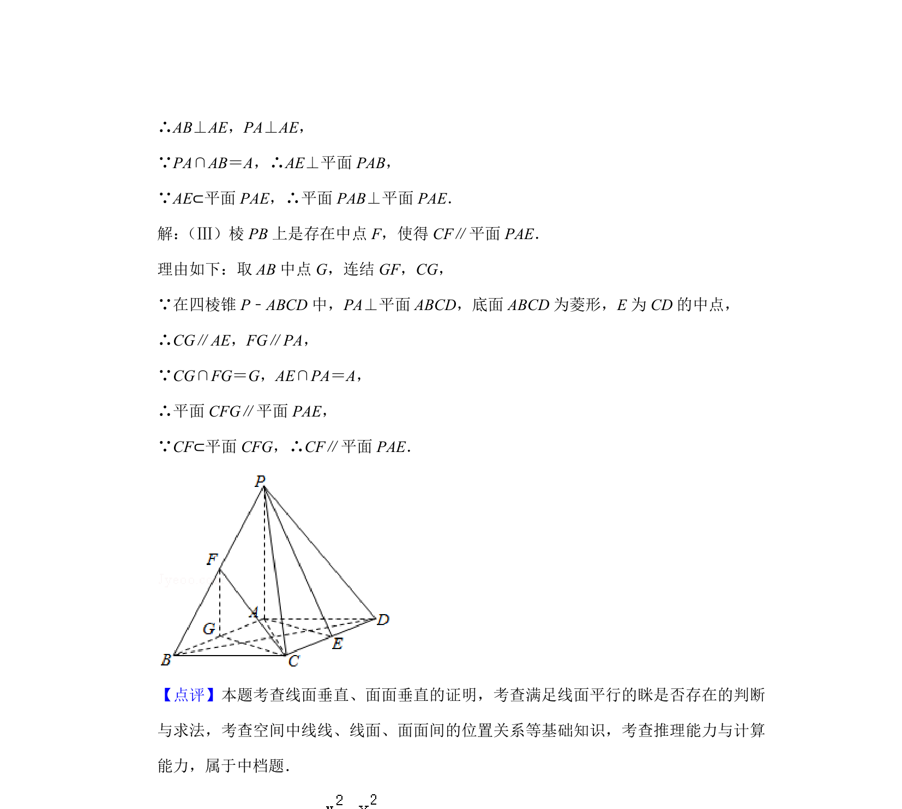

## 题面

## 摘要

在四棱锥中，证明线面垂直、面面垂直，并探究线面平行存在性。

## 关联考点

- [[1087-线面垂直的判定与性质|线面垂直的判定与性质]]
- [[1150-面面垂直的判定|面面垂直的判定]]
- [[线面平行的判定]]
- [[428-存在性问题|存在性问题]]

## 答案与解析

> 📄 原 PDF 第 11 页：`素材/真题/北京/2008-2024·（北京）数学高考真题/2019年高考数学试卷（文）（北京）（解析卷）.pdf`
