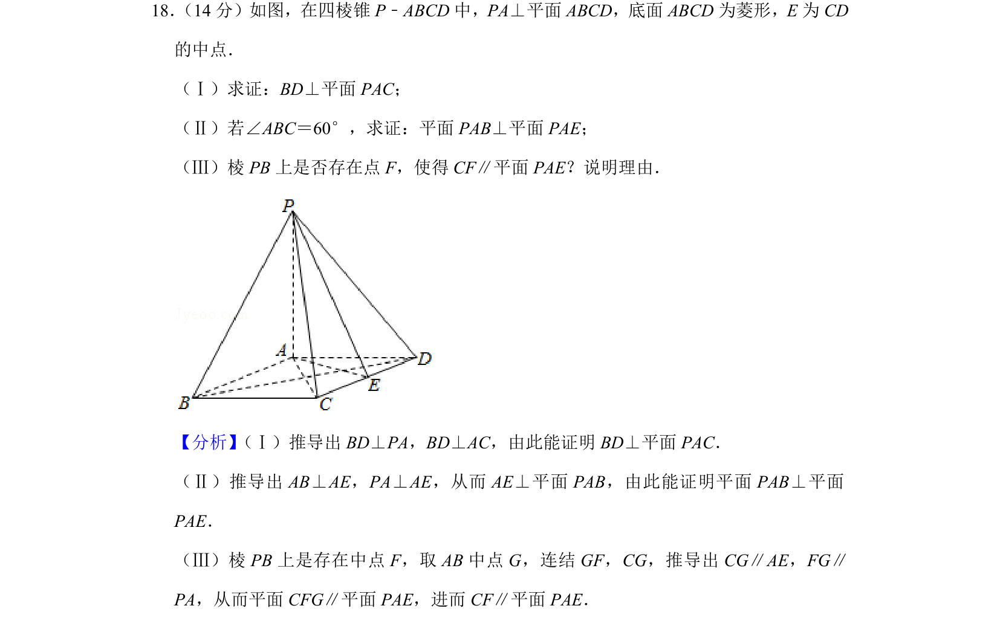
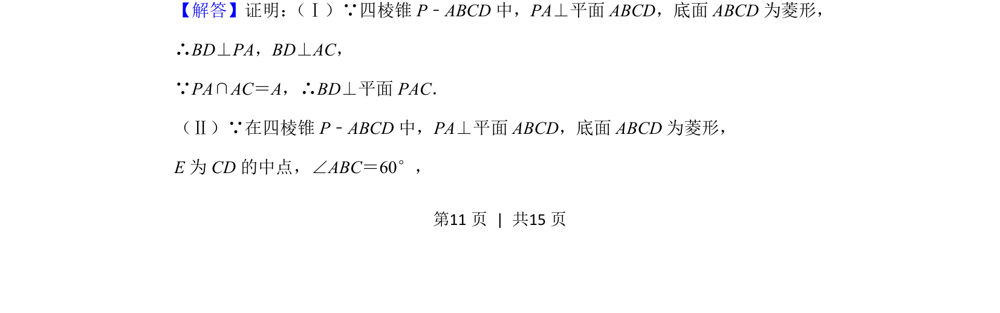
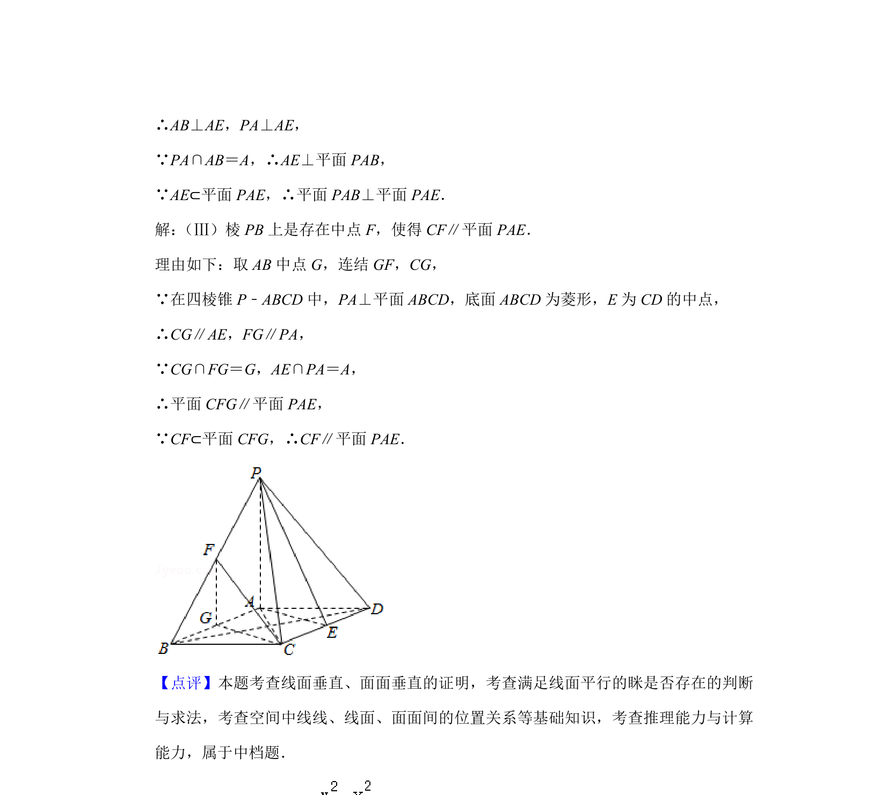

## 题面

## 摘要

在四棱锥中，证明线面垂直、面面垂直，并探究线面平行存在性。

## 关联考点

- [[1086-线面垂直的判定与性质|线面垂直的判定与性质]]
- [[1149-面面垂直的判定|面面垂直的判定]]
- [[1400-线面平行的判定|线面平行的判定]]
- [[428-存在性问题|存在性问题]]

## 答案与解析

> 📄 原 PDF 第 11 页：`素材/真题/北京/2008-2024·（北京）数学高考真题/2019年高考数学试卷（文）（北京）（解析卷）.pdf`

<!-- 题干文本-start -->
## 题干文本
18． （14分）如图，在四棱锥P﹣ABCD中，PA⊥平面ABCD，底面ABCD为菱形，E为CD
的中点．
（Ⅰ）求证：BD⊥平面PAC；
（Ⅱ）若∠ABC＝60°，求证：平面PAB⊥平面PAE；
（Ⅲ）棱PB上是否存在点F，使得CF∥平面PAE？说明理由．
<!-- 题干文本-end -->

<!-- 解析文本-start -->
## 解析文本
【分析】 （Ⅰ）推导出BD⊥PA，BD⊥AC，由此能证明BD⊥平面PAC．
（Ⅱ）推导出AB⊥AE，PA⊥AE，从而AE⊥平面PAB，由此能证明平面PAB⊥平面
PAE．
（Ⅲ）棱PB上是存在中点F，取AB中点G，连结GF，CG，推导出CG∥AE，FG∥
PA，从而平面CFG∥平面PAE，进而CF∥平面PAE．
【解答】证明： （Ⅰ）∵四棱锥P﹣ABCD中，PA⊥平面ABCD，底面ABCD为菱形，
∴BD⊥PA，BD⊥AC，
∵PA∩AC＝A，∴BD⊥平面PAC．
（Ⅱ）∵在四棱锥P﹣ABCD中，PA⊥平面ABCD，底面ABCD为菱形，
E为CD的中点，∠ABC＝60°，
<!-- 解析文本-end -->
