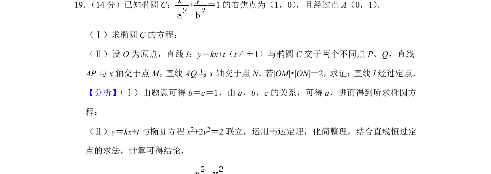
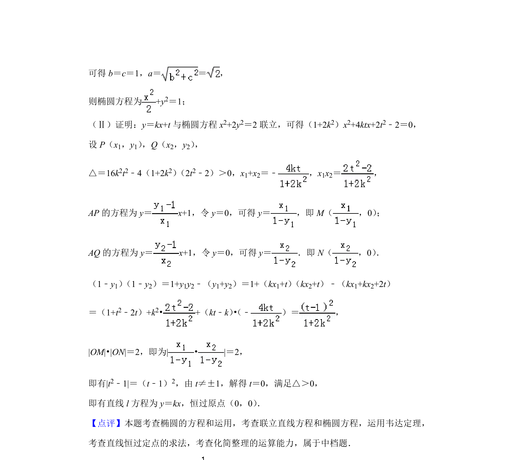

## 题面

## 摘要

求椭圆方程及直线与椭圆交点相关定点问题

## 关联考点

- [[941-椭圆标准方程|椭圆标准方程]]
- [[1391-直线与椭圆位置关系|直线与椭圆位置关系]]
- [[234-韦达定理-初中|韦达定理]]
- [[377-定点定值问题|定点问题]]

## 答案与解析

> 📄 原 PDF 第 12 页：`素材/真题/北京/2008-2024·（北京）数学高考真题/2019年高考数学试卷（文）（北京）（解析卷）.pdf`
