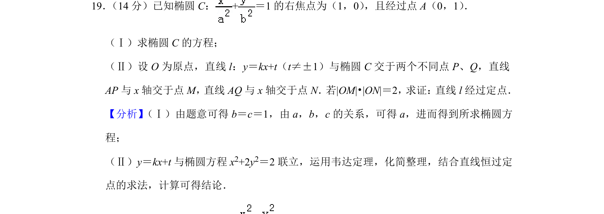
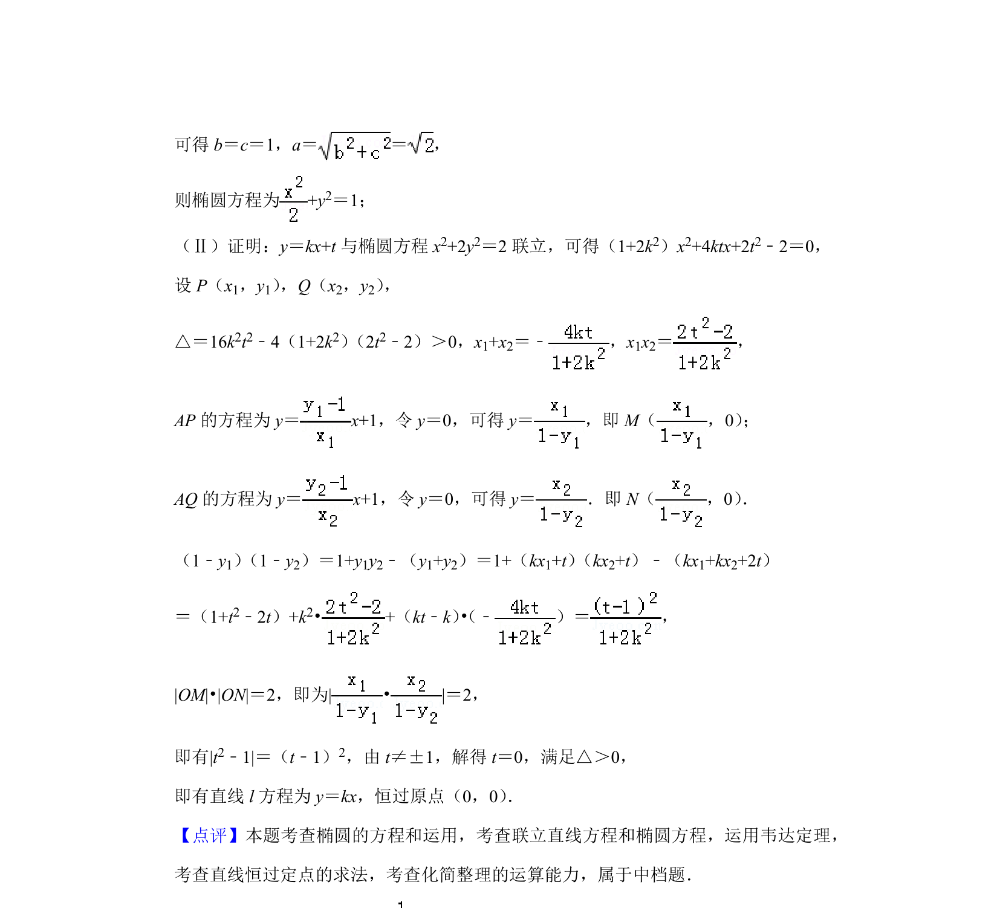

## 题面

## 摘要

求椭圆方程及直线与椭圆交点相关定点问题

## 关联考点

- [[941-椭圆标准方程|椭圆标准方程]]
- [[1391-直线与椭圆位置关系|直线与椭圆位置关系]]
- [[234-韦达定理-初中|韦达定理]]
- [[377-定点定值问题|定点问题]]

## 答案与解析

> 📄 原 PDF 第 12 页：`素材/真题/北京/2008-2024·（北京）数学高考真题/2019年高考数学试卷（文）（北京）（解析卷）.pdf`

<!-- 题干文本-start -->
## 题干文本
19． （14分）已知椭圆C：+＝1的右焦点为（1，0） ，且经过点A（0，1） ．
（Ⅰ）求椭圆C的方程；
（Ⅱ）设O为原点，直线l：y＝kx+t（t≠±1）与椭圆C交于两个不同点P、Q，直线
AP与x轴交于点M， 直线AQ与x轴交于点N． 若|OM|•|ON|＝2， 求证： 直线l经过定点．
<!-- 题干文本-end -->

<!-- 解析文本-start -->
## 解析文本
【分析】 （Ⅰ）由题意可得b＝c＝1，由a，b，c的关系，可得a，进而得到所求椭圆方
程；
（Ⅱ）y＝kx+t与椭圆方程x 2+2y2＝2联立，运用韦达定理，化简整理，结合直线恒过定
点的求法，计算可得结论．
【解答】解： （Ⅰ）椭圆C：+＝1的右焦点为（1，0） ，且经过点A（0，1） ．
<!-- 解析文本-end -->
