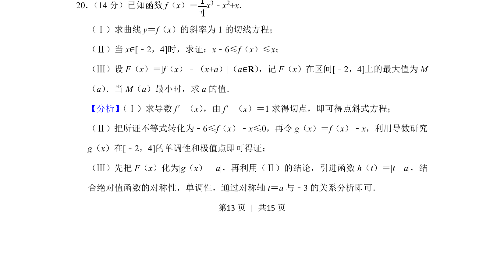
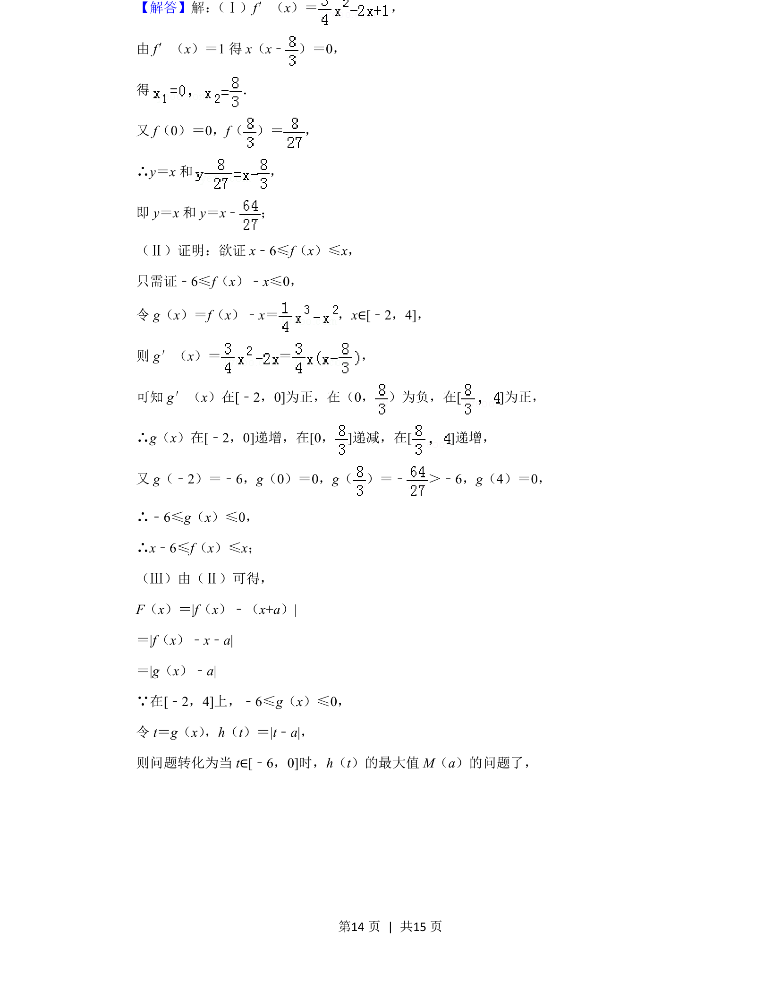
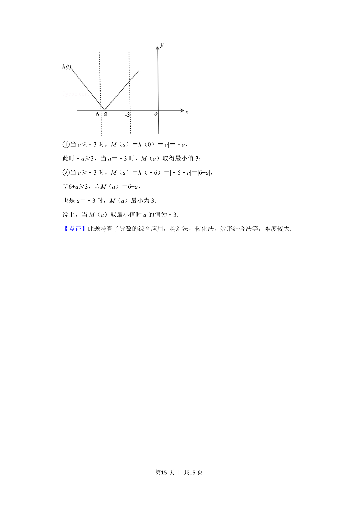

## 题面

## 摘要

考查函数导数几何意义、利用导数证明不等式及含绝对值的最值问题。

## 关联考点

- [[440-导数的几何意义|导数的几何意义]]
- [[1272-利用导数研究函数单调性|利用导数研究函数单调性]]
- [[419-函数最值-高中|函数最值]]
- [[585-绝对值函数|绝对值函数]]

## 答案与解析

> 📄 原 PDF 第 13 页：`素材/真题/北京/2008-2024·（北京）数学高考真题/2019年高考数学试卷（文）（北京）（解析卷）.pdf`
