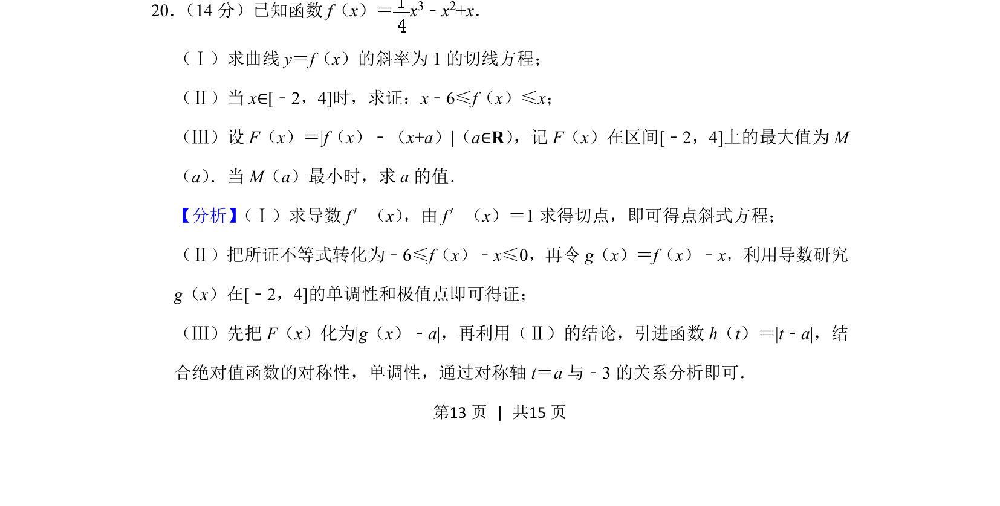
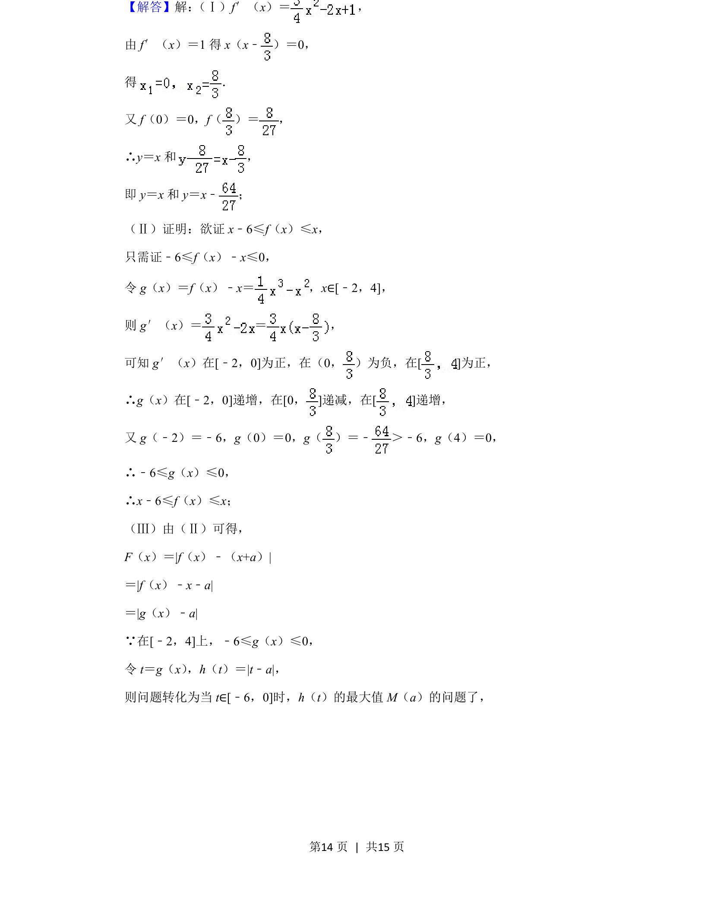
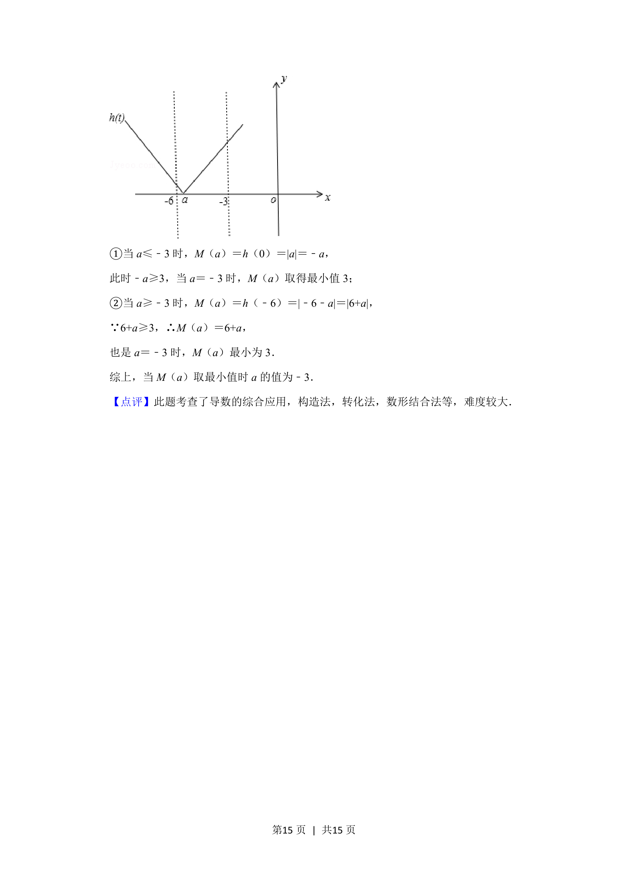

## 题面

## 摘要

考查函数导数几何意义、利用导数证明不等式及含绝对值的最值问题。

## 关联考点

- [[440-导数的几何意义|导数的几何意义]]
- [[705-利用导数研究函数的单调性|利用导数研究函数单调性]]
- [[419-函数最值-高中|函数最值]]
- [[585-绝对值函数|绝对值函数]]

## 答案与解析

> 📄 原 PDF 第 13 页：`素材/真题/北京/2008-2024·（北京）数学高考真题/2019年高考数学试卷（文）（北京）（解析卷）.pdf`

<!-- 题干文本-start -->
## 题干文本
20． （14分）已知函数f（x）＝x 3﹣x2+x．
（Ⅰ）求曲线y＝f（x）的斜率为1的切线方程；
（Ⅱ）当x∈[﹣2，4]时，求证：x﹣6≤f（x）≤x；
（Ⅲ）设F（x）＝|f（x）﹣（x+a）|（a∈R） ，记F（x）在区间[﹣2，4]上的最大值为M
（a） ．当M（a）最小时，求a的值．
<!-- 题干文本-end -->

<!-- 解析文本-start -->
## 解析文本
【分析】 （Ⅰ）求导数f′（x） ，由f′（x）＝1求得切点，即可得点斜式方程；
（Ⅱ）把所证不等式转化为﹣6≤f（x）﹣x≤0，再令g（x）＝f（x）﹣x，利用导数研究
g（x）在[﹣2，4]的单调性和极值点即可得证；
（Ⅲ）先把F（x）化为|g（x）﹣a|，再利用（Ⅱ）的结论，引进函数h（t）＝|t﹣a|，结
合绝对值函数的对称性，单调性，通过对称轴t＝a与﹣3的关系分析即可．
<!-- 解析文本-end -->
