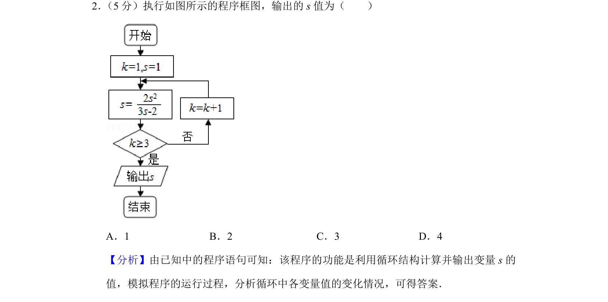
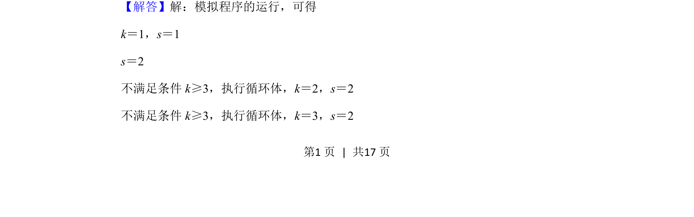
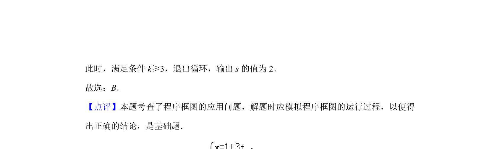

## 题面

## 摘要

本题通过程序框图考查循环结构，模拟运行过程求输出变量s的值

## 关联考点

- [[1042-程序框图|程序框图]]
- [[870-循环结构|循环结构]]

## 答案与解析

> 📄 原 PDF 第 1 页：`素材/真题/北京/2008-2024·（北京）数学高考真题/2019年高考数学试卷（理）（北京）（解析卷）.pdf`

<!-- 题干文本-start -->
## 题干文本
2． （5分）执行如图所示的程序框图，输出的s值为（　　）
A．1 B．2 C．3 D．4
<!-- 题干文本-end -->

<!-- 解析文本-start -->
## 解析文本
【分析】由已知中的程序语句可知：该程序的功能是利用循环结构计算并输出变量s的
值，模拟程序的运行过程，分析循环中各变量值的变化情况，可得答案．
【解答】解：模拟程序的运行，可得
k＝1，s＝1
s＝2
不满足条件k≥3，执行循环体，k＝2，s＝2
不满足条件k≥3，执行循环体，k＝3，s＝2
<!-- 解析文本-end -->
