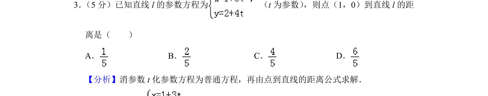
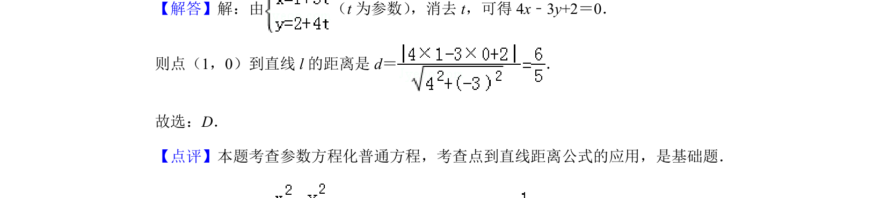

## 题面

## 摘要

参数方程化为普通方程，再利用点到直线距离公式求解。

## 关联考点

- [[723-参数方程化普通方程|参数方程化普通方程]]
- [[570-点到直线的距离公式|点到直线的距离公式]]

## 答案与解析

> 📄 原 PDF 第 2 页：`素材/真题/北京/2008-2024·（北京）数学高考真题/2019年高考数学试卷（理）（北京）（解析卷）.pdf`
