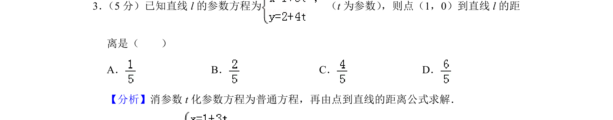
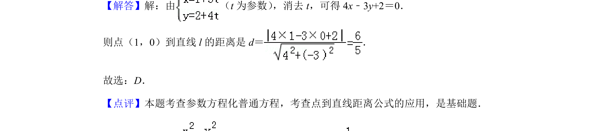

## 题面

## 摘要

参数方程化为普通方程，再利用点到直线距离公式求解。

## 关联考点

- [[723-参数方程化普通方程|参数方程化普通方程]]
- [[570-点到直线的距离公式|点到直线的距离公式]]

## 答案与解析

> 📄 原 PDF 第 2 页：`素材/真题/北京/2008-2024·（北京）数学高考真题/2019年高考数学试卷（理）（北京）（解析卷）.pdf`

<!-- 题干文本-start -->
## 题干文本
3． （5分）已知直线l的参数方程为 （t为参数） ，则点（1，0）到直线l的距
离是（　　）
A．B．C．D．
<!-- 题干文本-end -->

<!-- 解析文本-start -->
## 解析文本
【分析】消参数t化参数方程为普通方程，再由点到直线的距离公式求解．
【解答】解：由 （t为参数） ，消去t，可得4x﹣3y+2＝0．
则点（1，0）到直线l的距离是d＝ ．
故选：D．
【点评】本题考查参数方程化普通方程，考查点到直线距离公式的应用，是基础题．
<!-- 解析文本-end -->
