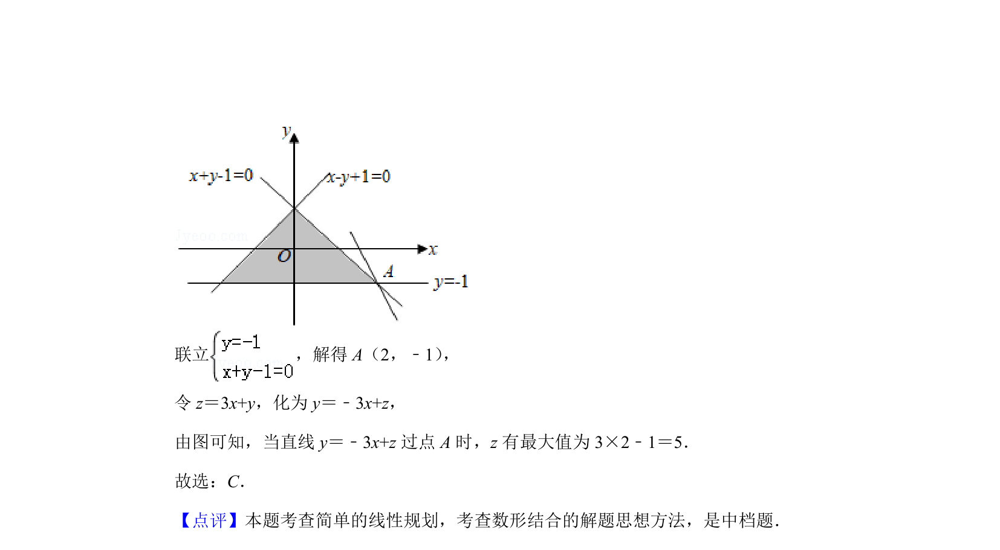

## 题面

## 摘要

本题主要考查由含绝对值的约束条件作出可行域，并利用数形结合求线性目标函数的最值。

## 关联考点

- [[1074-简单线性规划|线性规划]]
- [[1156-可行域|可行域]]
- [[1000-目标函数最值|目标函数最值]]
- [[1092-绝对值不等式|绝对值不等式]]

## 答案与解析

> 📄 原 PDF 第 2 页：`素材/真题/北京/2008-2024·（北京）数学高考真题/2019年高考数学试卷（理）（北京）（解析卷）.pdf`
