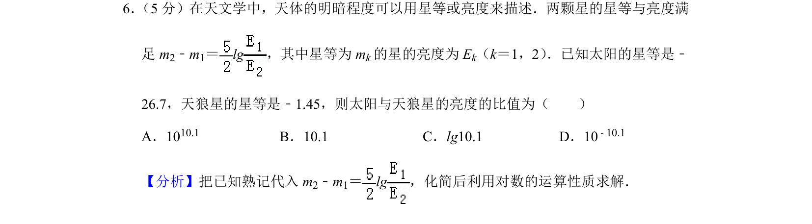
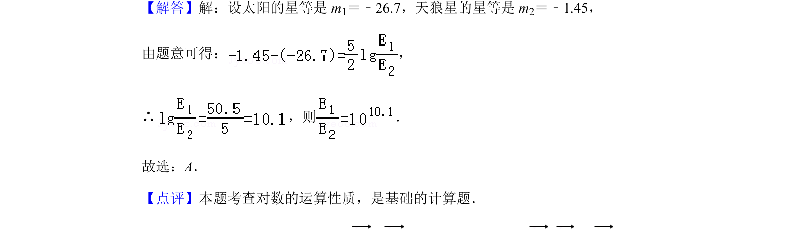

## 题面

## 摘要

利用对数关系式求解天体亮度比值，考查对数的运算性质。

## 关联考点

- [[对数的运算性质]]
- [[指数与对数互化]]

## 答案与解析

> 📄 原 PDF 第 3 页：`素材/真题/北京/2008-2024·（北京）数学高考真题/2019年高考数学试卷（理）（北京）（解析卷）.pdf`

<!-- 题干文本-start -->
## 题干文本
6． （5分）在天文学中，天体的明暗程度可以用星等或亮度来描述．两颗星的星等与亮度满
足m 2﹣m1＝lg，其中星等为m k的星的亮度为E k（k＝1，2） ．已知太阳的星等是﹣
26.7，天狼星的星等是﹣1.45，则太阳与天狼星的亮度的比值为（　　）
A．1010.1 B．10.1 C．lg10.1 D．10 ﹣10.1
<!-- 题干文本-end -->

<!-- 解析文本-start -->
## 解析文本
【分析】把已知熟记代入m 2﹣m1＝lg，化简后利用对数的运算性质求解．
【解答】解：设太阳的星等是m 1＝﹣26.7，天狼星的星等是m 2＝﹣1.45，
由题意可得： ，
∴ ，则 ．
故选：A．
【点评】本题考查对数的运算性质，是基础的计算题．
<!-- 解析文本-end -->
