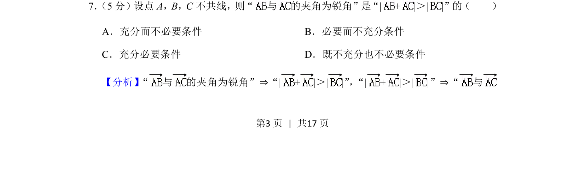
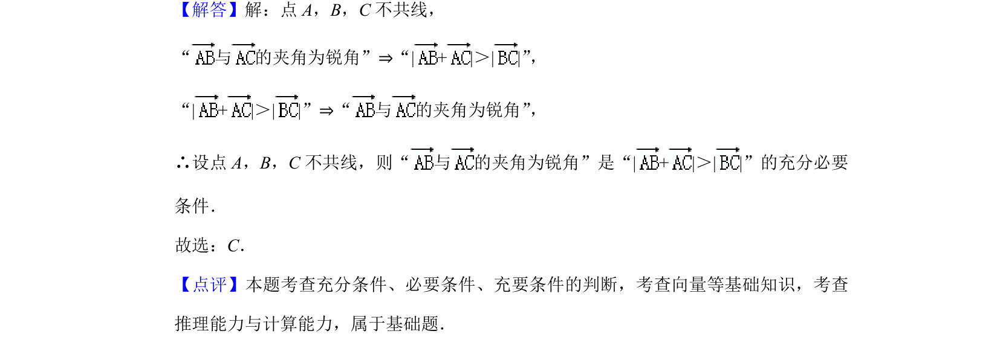

## 题面

## 摘要

本题通过向量模长不等式与夹角的关系考查充分必要条件的判断。

## 关联考点

- [[324-向量的夹角|向量的夹角]]
- [[752-向量模长|向量的模]]
- [[533-充分必要条件|充分必要条件]]

## 答案与解析

> 📄 原 PDF 第 3 页：`素材/真题/北京/2008-2024·（北京）数学高考真题/2019年高考数学试卷（理）（北京）（解析卷）.pdf`
