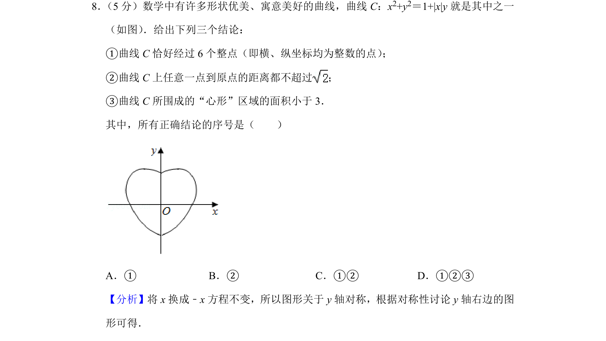
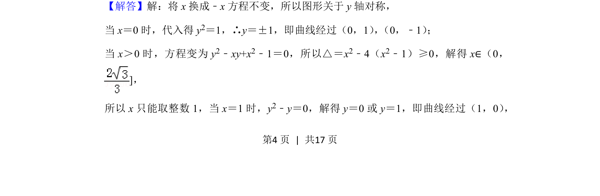
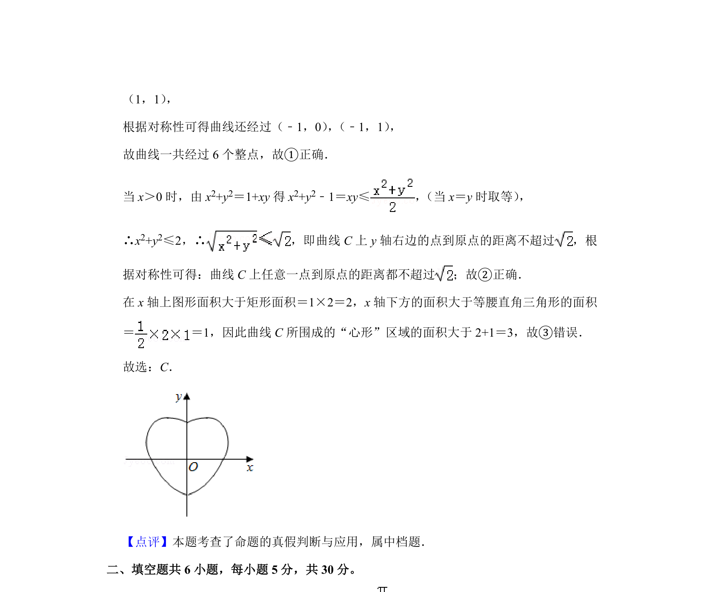

## 题面

## 摘要

本题给出心形曲线方程，判断其对称性、整点个数、最远距离及所围面积大小，考查曲线与方程的综合分析。

## 关联考点

- [[曲线方程]]
- [[835-对称性|对称性]]
- [[整点]]
- [[286-函数的最值|最值]]
- [[面积估算]]

## 答案与解析

> 📄 原 PDF 第 4 页：`素材/真题/北京/2008-2024·（北京）数学高考真题/2019年高考数学试卷（理）（北京）（解析卷）.pdf`
