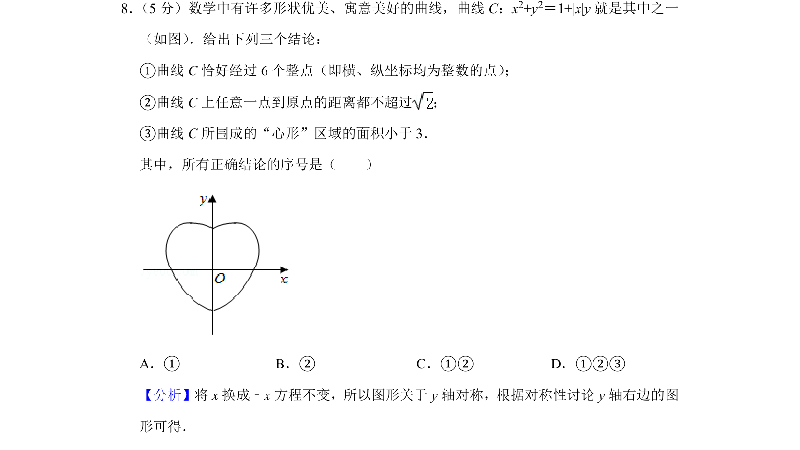
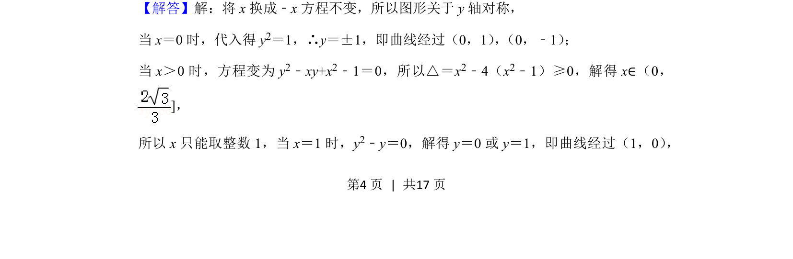
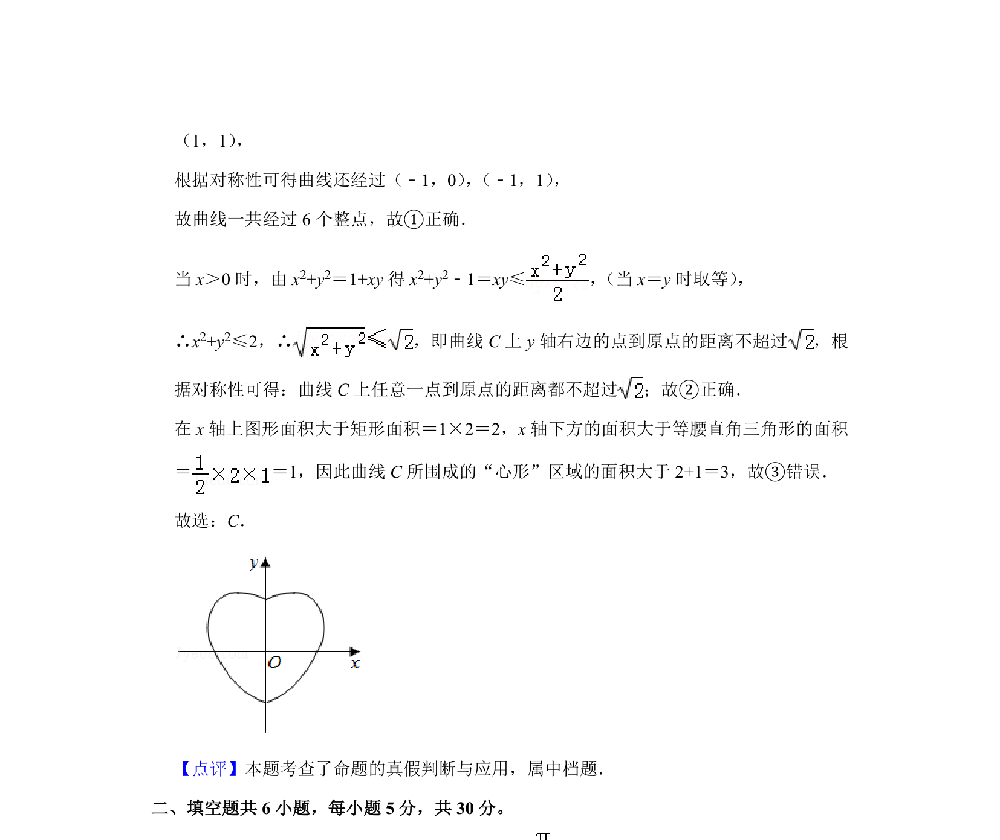

## 题面

## 摘要

本题给出心形曲线方程，判断其对称性、整点个数、最远距离及所围面积大小，考查曲线与方程的综合分析。

## 关联考点

- [[曲线方程]]
- [[835-对称性|对称性]]
- [[1384-整点|整点]]
- [[286-函数的最值|最值]]
- [[面积估算]]

## 答案与解析

> 📄 原 PDF 第 4 页：`素材/真题/北京/2008-2024·（北京）数学高考真题/2019年高考数学试卷（理）（北京）（解析卷）.pdf`

<!-- 题干文本-start -->
## 题干文本
8． （5分）数学中有许多形状优美、寓意美好的曲线，曲线C：x2+y2＝1+|x|y就是其中之一
（如图） ．给出下列三个结论：
①曲线C恰好经过6个整点（即横、纵坐标均为整数的点） ；
②曲线C上任意一点到原点的距离都不超过 ；
③曲线C所围成的“心形”区域的面积小于3．
其中，所有正确结论的序号是（　　）
A．①B．②C．①②D．①②③
<!-- 题干文本-end -->

<!-- 解析文本-start -->
## 解析文本
【分析】将x换成﹣x方程不变，所以图形关于y轴对称，根据对称性讨论y轴右边的图
形可得．
【解答】解：将x换成﹣x方程不变，所以图形关于y轴对称，
当x＝0时，代入得y 2＝1，∴y＝±1，即曲线经过（0，1） ， （0，﹣1） ；
当x＞0时，方程变为y 2﹣xy+x2﹣1＝0，所以△＝x 2﹣4（x 2﹣1）≥0，解得x∈（0，
]，
所以x只能取整数1，当x＝1时，y 2﹣y＝0，解得y＝0或y＝1，即曲线经过（1，0） ，
<!-- 解析文本-end -->
