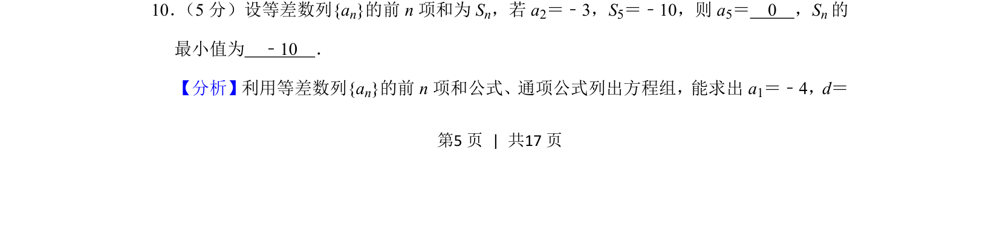
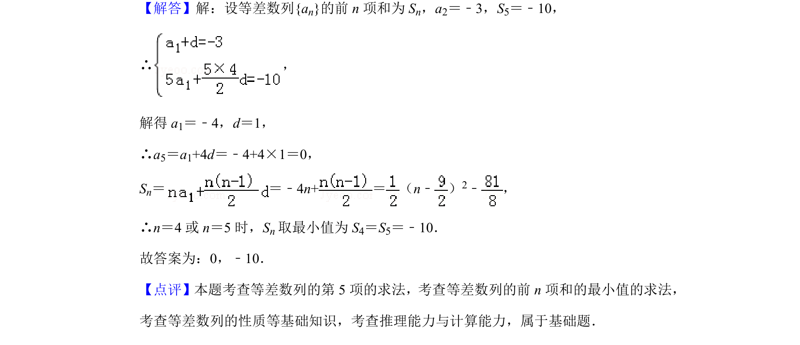

## 题面

## 摘要

等差数列通项与前n项和公式应用，求特定项及和的最小值。

## 关联考点

- [[等差数列通项]]
- [[355-等差数列前n项和|等差数列前n项和]]
- [[640-二次函数最值|二次函数最值]]

## 答案与解析

> 📄 原 PDF 第 5 页：`素材/真题/北京/2008-2024·（北京）数学高考真题/2019年高考数学试卷（理）（北京）（解析卷）.pdf`
