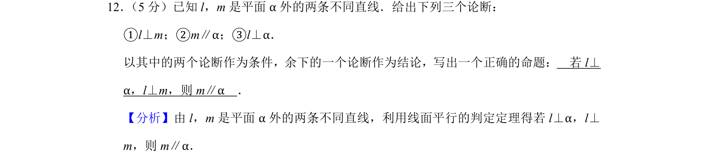
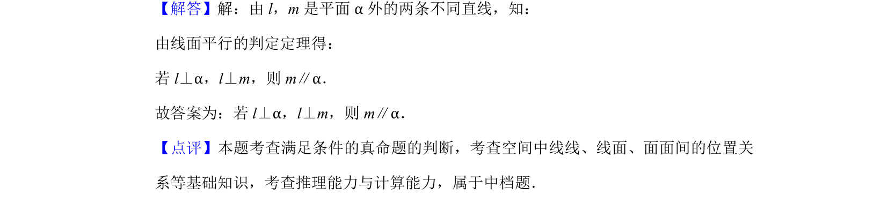

## 题面

## 摘要

已知空间线面位置关系，以两个论断为条件构造真命题。

## 关联考点

- [[1393-线面平行判定定理|线面平行判定定理]]
- [[空间中线线关系线面关系]]
- [[命题构造]]

## 答案与解析

> 📄 原 PDF 第 7 页：`素材/真题/北京/2008-2024·（北京）数学高考真题/2019年高考数学试卷（理）（北京）（解析卷）.pdf`

<!-- 题干文本-start -->
## 题干文本
12． （5分）已知l，m是平面α外的两条不同直线．给出下列三个论断：
①l⊥m；②m∥α；③l⊥α．
以其中的两个论断作为条件，余下的一个论断作为结论，写出一个正确的命题：　若l⊥
α，l⊥m，则m∥α　．
<!-- 题干文本-end -->

<!-- 解析文本-start -->
## 解析文本
【分析】由l，m是平面α外的两条不同直线，利用线面平行的判定定理得若l⊥α，l⊥
m，则m∥α．
【解答】解：由l，m是平面α外的两条不同直线，知：
由线面平行的判定定理得：
若l⊥α，l⊥m，则m∥α．
故答案为：若l⊥α，l⊥m，则m∥α．
【点评】本题考查满足条件的真命题的判断，考查空间中线线、线面、面面间的位置关
系等基础知识，考查推理能力与计算能力，属于中档题．
<!-- 解析文本-end -->
