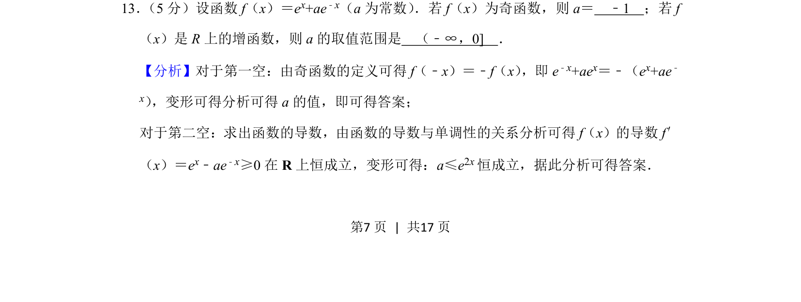
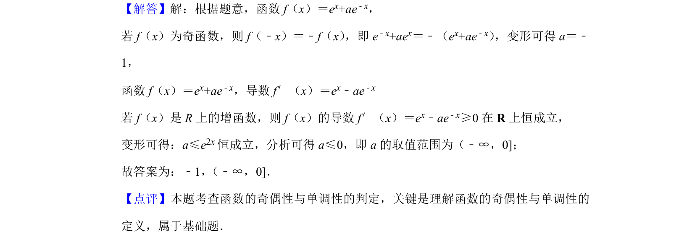

## 题面

## 摘要

考查利用奇函数定义求参数及利用导数研究指数型函数的单调性求参数范围。

## 关联考点

- [[820-奇函数性质|奇函数性质]]
- [[705-利用导数研究函数的单调性|导数与单调性]]
- [[304-指数函数|指数函数]]
- [[450-恒成立问题|恒成立问题]]

## 答案与解析

> 📄 原 PDF 第 7 页：`素材/真题/北京/2008-2024·（北京）数学高考真题/2019年高考数学试卷（理）（北京）（解析卷）.pdf`
