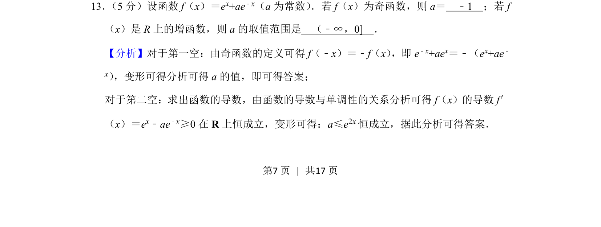
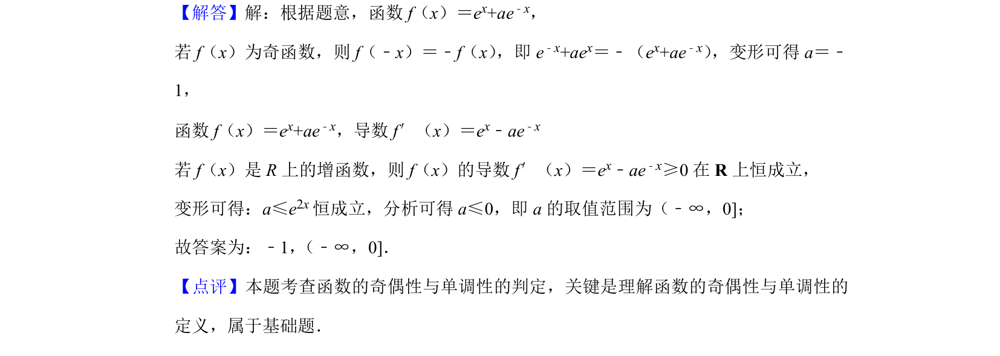

## 题面

## 摘要

考查利用奇函数定义求参数及利用导数研究指数型函数的单调性求参数范围。

## 关联考点

- [[820-奇函数性质|奇函数性质]]
- [[705-利用导数研究函数的单调性|导数与单调性]]
- [[304-指数函数|指数函数]]
- [[450-恒成立问题|恒成立问题]]

## 答案与解析

> 📄 原 PDF 第 7 页：`素材/真题/北京/2008-2024·（北京）数学高考真题/2019年高考数学试卷（理）（北京）（解析卷）.pdf`

<!-- 题干文本-start -->
## 题干文本
13． （5分）设函数f（x）＝ex+ae﹣x（a为常数） ．若f（x）为奇函数，则a＝　﹣1　；若f
（x）是R上的增函数，则a的取值范围是　（﹣∞，0]　．
<!-- 题干文本-end -->

<!-- 解析文本-start -->
## 解析文本
【分析】对于第一空：由奇函数的定义可得f（﹣x）＝﹣f（x） ，即e﹣x+aex＝﹣（ex+ae﹣
x） ，变形可得分析可得a的值，即可得答案；
对于第二空：求出函数的导数，由函数的导数与单调性的关系分析可得f（x）的导数f′
（x）＝ex﹣ae﹣x≥0在R上恒成立，变形可得：a≤e 2x恒成立，据此分析可得答案．
<!-- 解析文本-end -->
