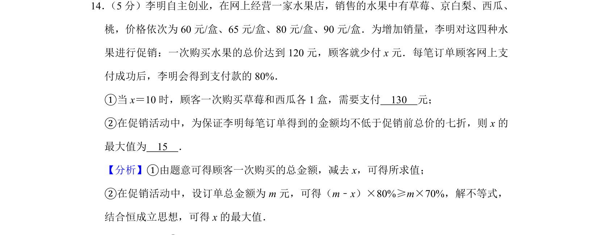
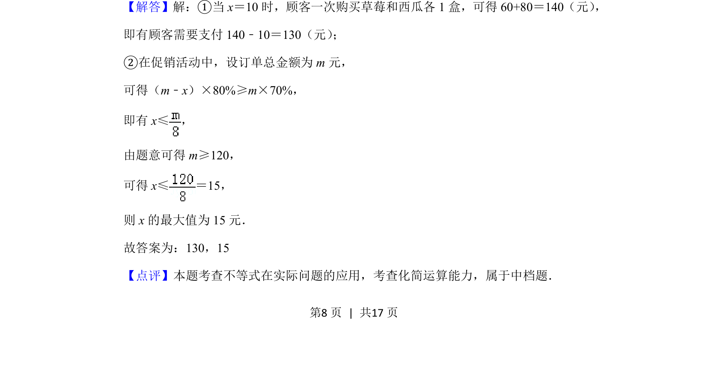
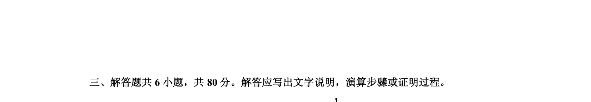

## 题面

## 摘要

该题考查不等式在促销实际问题中的应用，涉及支付计算与最值求解。

## 关联考点

- [[不等式的实际应用]]
- [[一次函数模型]]
- [[百分数运算]]
- [[913-最值问题|最值问题]]

## 答案与解析

> 📄 原 PDF 第 8 页：`素材/真题/北京/2008-2024·（北京）数学高考真题/2019年高考数学试卷（理）（北京）（解析卷）.pdf`
