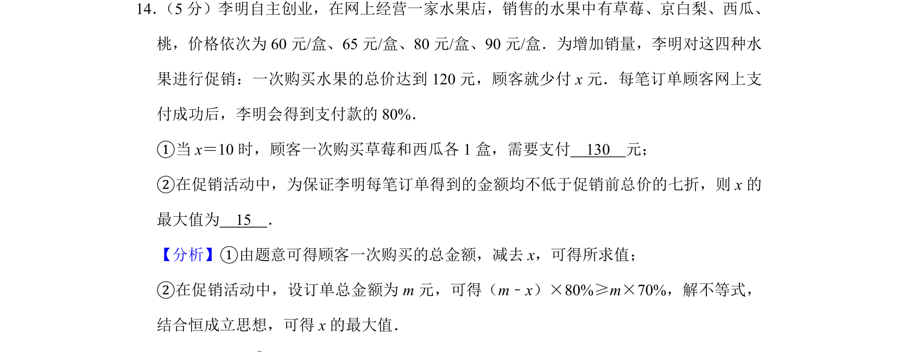
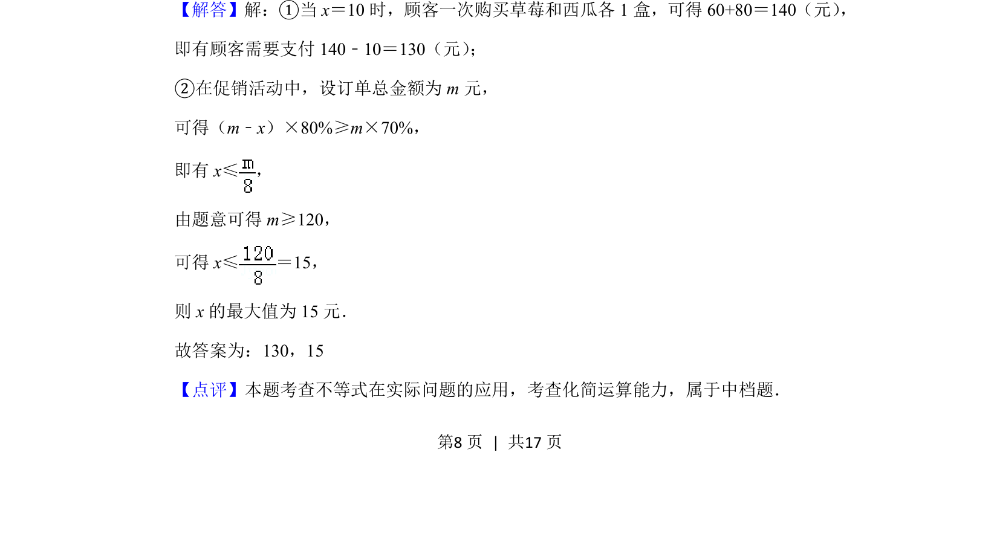

## 题面

## 摘要

该题考查不等式在促销实际问题中的应用，涉及支付计算与最值求解。

## 关联考点

- [[不等式的实际应用]]
- [[一次函数模型]]
- [[百分数运算]]
- [[913-最值问题|最值问题]]

## 答案与解析

> 📄 原 PDF 第 8 页：`素材/真题/北京/2008-2024·（北京）数学高考真题/2019年高考数学试卷（理）（北京）（解析卷）.pdf`

<!-- 题干文本-start -->
## 题干文本
14． （5分）李明自主创业，在网上经营一家水果店，销售的水果中有草莓、京白梨、西瓜、
桃，价格依次为60元/盒、65元/盒、80元/盒、90元/盒．为增加销量，李明对这四种水
果进行促销：一次购买水果的总价达到120元，顾客就少付x元．每笔订单顾客网上支
付成功后，李明会得到支付款的80%．
①当x＝10时，顾客一次购买草莓和西瓜各1盒，需要支付　130　元；
②在促销活动中，为保证李明每笔订单得到的金额均不低于促销前总价的七折，则x的
最大值为　15　．
<!-- 题干文本-end -->

<!-- 解析文本-start -->
## 解析文本
【分析】①由题意可得顾客一次购买的总金额，减去x，可得所求值；
②在促销活动中，设订单总金额为m元，可得（m﹣x）×80%≥m×70%，解不等式，
结合恒成立思想，可得x的最大值．
【解答】解：①当x＝10时，顾客一次购买草莓和西瓜各1盒，可得60+80＝140（元） ，
即有顾客需要支付140﹣10＝130（元） ；
②在促销活动中，设订单总金额为m元，
可得（m﹣x）×80%≥m×70%，
即有x≤ ，
由题意可得m≥120，
可得x≤ ＝15，
则x的最大值为15元．
故答案为：130，15
【点评】本题考查不等式在实际问题的应用，考查化简运算能力，属于中档题．
<!-- 解析文本-end -->
