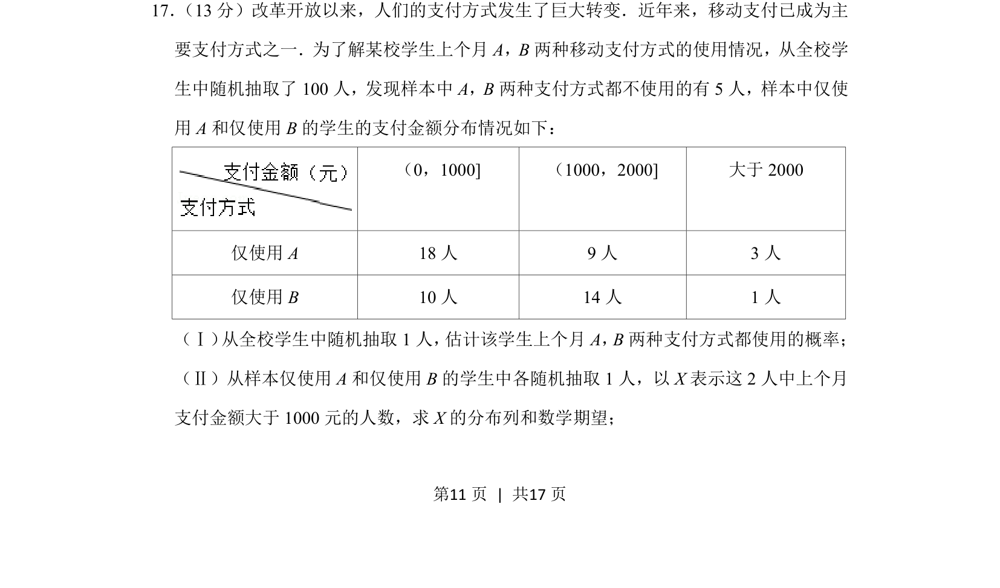
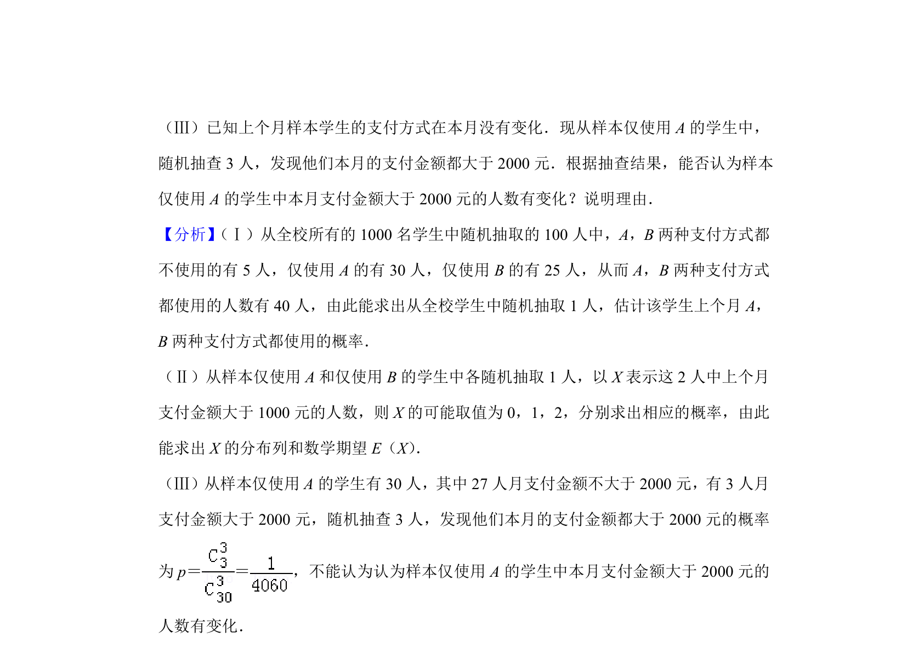
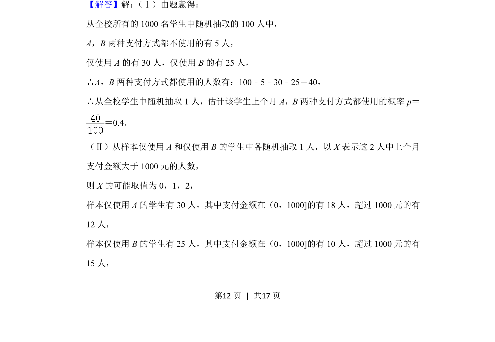
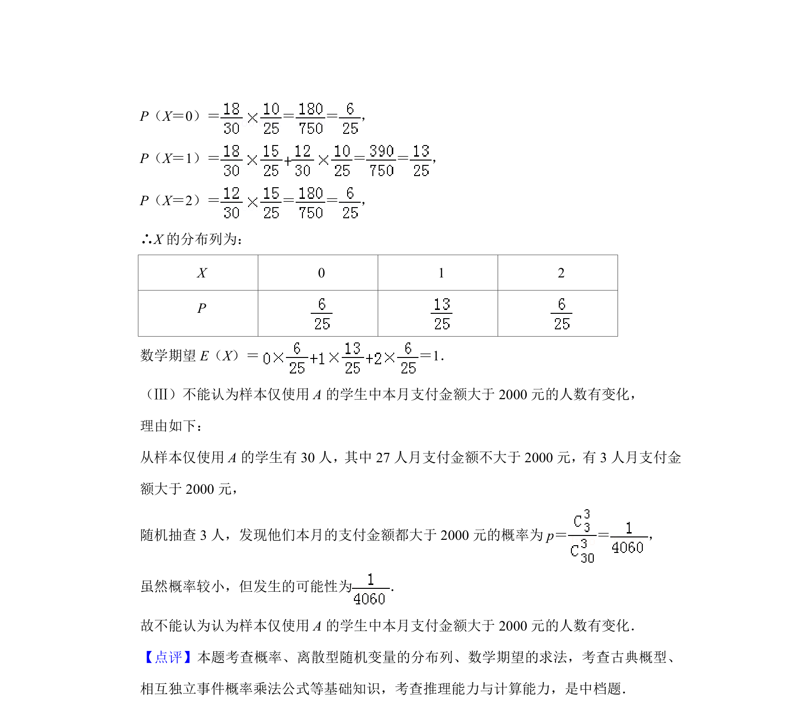

## 题面

## 摘要

从样本数据估计支付方式都使用的概率，并计算随机抽取两人中支付金额大于千元人数的分布列与期望。

## 关联考点

- [[1186-概率估计|概率估计]]
- [[1038-离散型随机变量分布列|离散型随机变量分布列]]
- [[1039-离散型随机变量的期望|数学期望]]

## 答案与解析

> 📄 原 PDF 第 11 页：`素材/真题/北京/2008-2024·（北京）数学高考真题/2019年高考数学试卷（理）（北京）（解析卷）.pdf`
