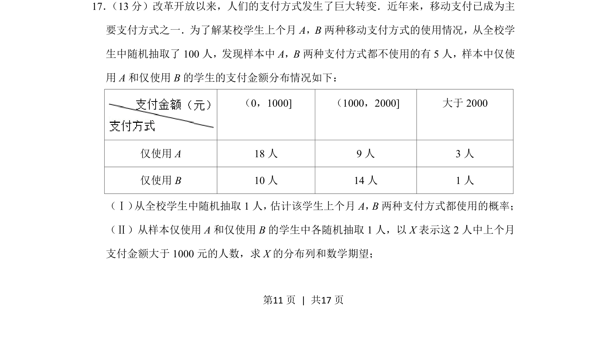
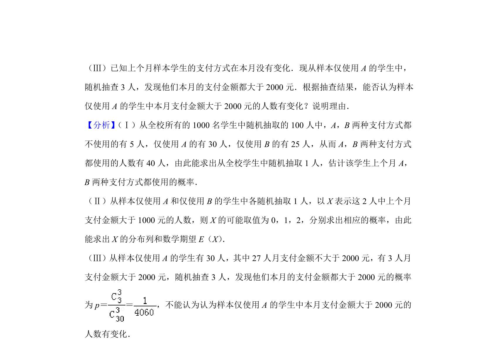
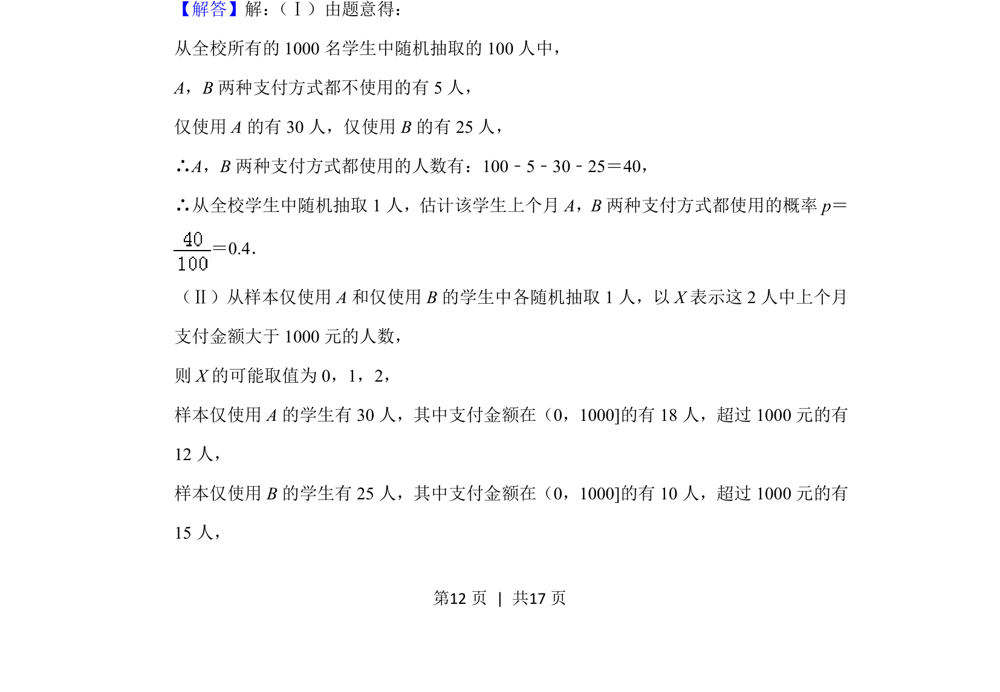
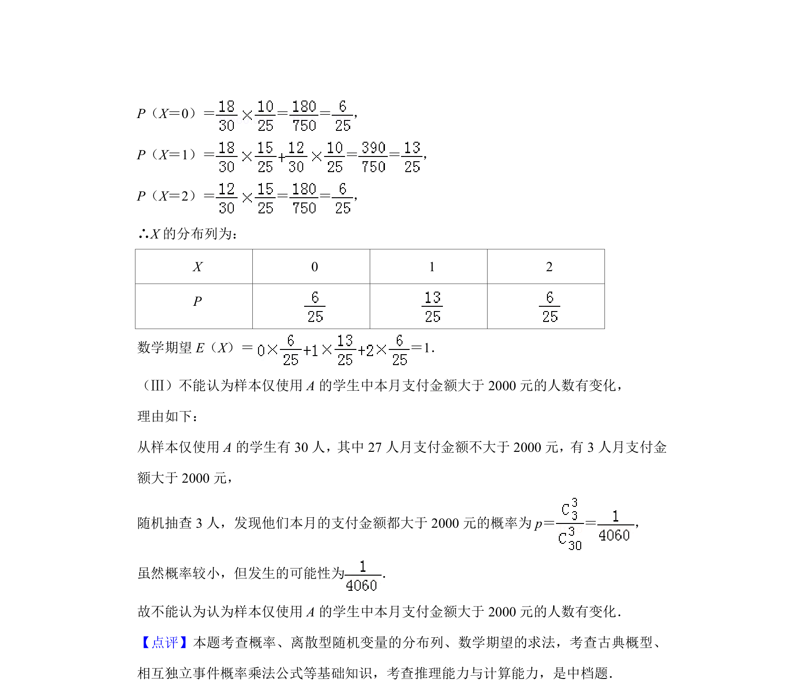

## 题面

## 摘要

从样本数据估计支付方式都使用的概率，并计算随机抽取两人中支付金额大于千元人数的分布列与期望。

## 关联考点

- [[1186-概率估计|概率估计]]
- [[1038-离散型随机变量分布列|离散型随机变量分布列]]
- [[501-离散型随机变量期望|数学期望]]

## 答案与解析

> 📄 原 PDF 第 11 页：`素材/真题/北京/2008-2024·（北京）数学高考真题/2019年高考数学试卷（理）（北京）（解析卷）.pdf`

<!-- 题干文本-start -->
## 题干文本
17． （13分）改革开放以来，人们的支付方式发生了巨大转变．近年来，移动支付已成为主
要支付方式之一．为了解某校学生上个月A，B两种移动支付方式的使用情况，从全校学
生中随机抽取了100人，发现样本中A，B两种支付方式都不使用的有5人，样本中仅使
用A和仅使用B的学生的支付金额分布情况如下：
（0，1000] （1000，2000] 大于2000
仅使用A 18人 9人 3人
仅使用B 10人 14人 1人
（Ⅰ） 从全校学生中随机抽取1人， 估计该学生上个月A，B两种支付方式都使用的概率；
（Ⅱ）从样本仅使用A和仅使用B的学生中各随机抽取1人，以X表示这2人中上个月
支付金额大于1000元的人数，求X的分布列和数学期望；
<!-- 题干文本-end -->

<!-- 解析文本-start -->
## 解析文本

<!-- 解析文本-end -->
