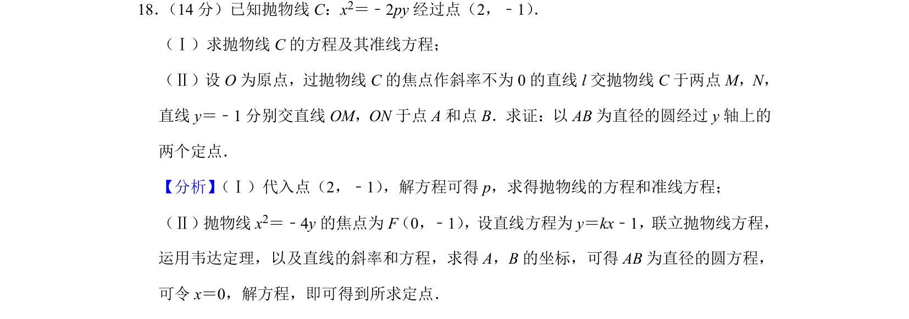
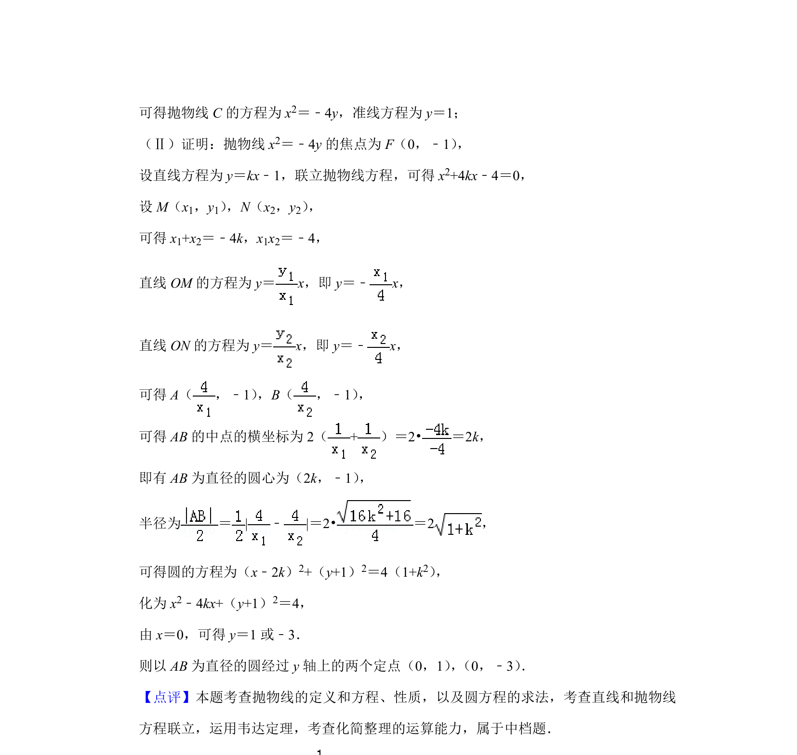

## 题面

## 摘要

求抛物线方程与准线，证明以动弦端点和定直线交点连线段为直径的圆过定点

## 关联考点

- [[1166-抛物线标准方程|抛物线标准方程]]
- [[1016-直线与抛物线位置关系|直线与抛物线位置关系]]
- [[234-韦达定理-初中|韦达定理]]
- [[圆过定点问题]]

## 答案与解析

> 📄 原 PDF 第 13 页：`素材/真题/北京/2008-2024·（北京）数学高考真题/2019年高考数学试卷（理）（北京）（解析卷）.pdf`
