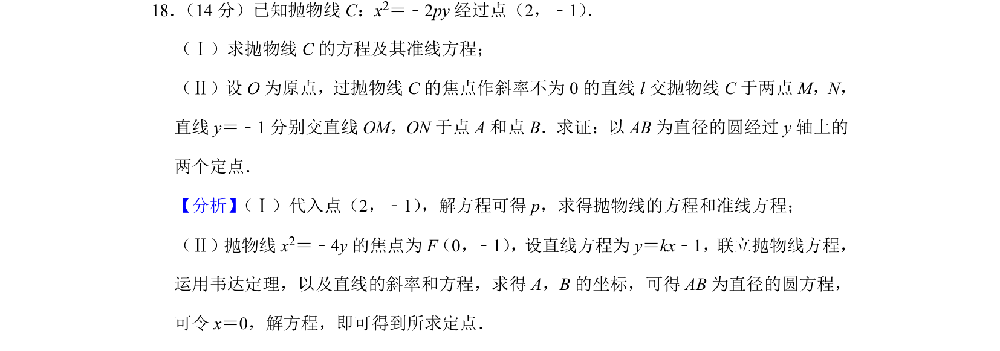
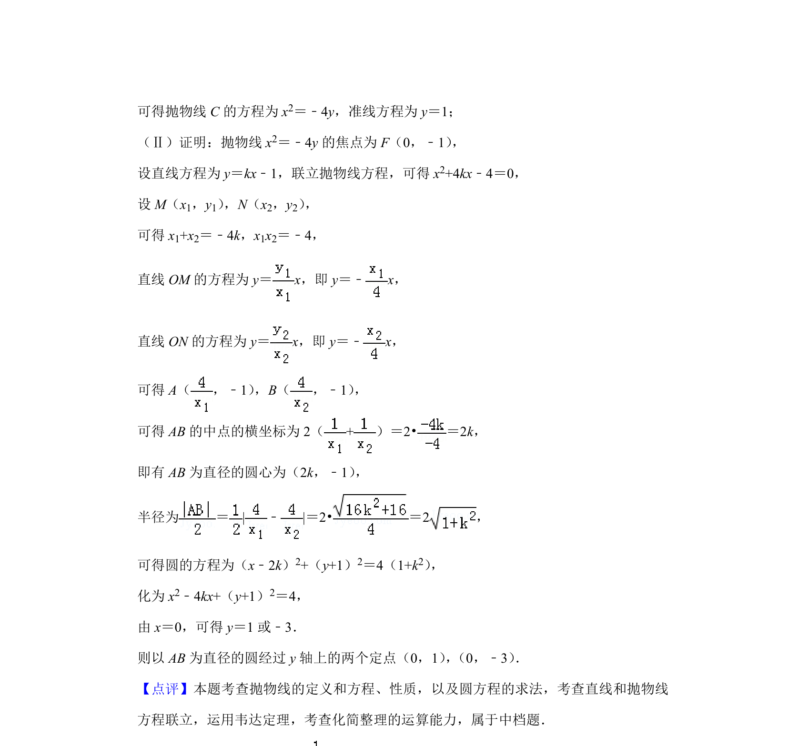

## 题面

## 摘要

求抛物线方程与准线，证明以动弦端点和定直线交点连线段为直径的圆过定点

## 关联考点

- [[1166-抛物线标准方程|抛物线标准方程]]
- [[1016-直线与抛物线位置关系|直线与抛物线位置关系]]
- [[234-韦达定理-初中|韦达定理]]
- [[圆过定点问题]]

## 答案与解析

> 📄 原 PDF 第 13 页：`素材/真题/北京/2008-2024·（北京）数学高考真题/2019年高考数学试卷（理）（北京）（解析卷）.pdf`

<!-- 题干文本-start -->
## 题干文本
18． （14分）已知抛物线C：x2＝﹣2py经过点（2，﹣1） ．
（Ⅰ）求抛物线C的方程及其准线方程；
（Ⅱ）设O为原点，过抛物线C的焦点作斜率不为0的直线l交抛物线C于两点M，N，
直线y＝﹣1分别交直线OM，ON于点A和点B．求证：以AB为直径的圆经过y轴上的
两个定点．
<!-- 题干文本-end -->

<!-- 解析文本-start -->
## 解析文本
【分析】 （Ⅰ）代入点（2，﹣1） ，解方程可得p，求得抛物线的方程和准线方程；
（Ⅱ）抛物线x2＝﹣4y的焦点为F（0，﹣1） ，设直线方程为y＝kx﹣1，联立抛物线方程，
运用韦达定理，以及直线的斜率和方程，求得A，B的坐标，可得AB为直径的圆方程，
可令x＝0，解方程，即可得到所求定点．
【解答】解： （Ⅰ）抛物线C：x2＝﹣2py经过点（2，﹣1） ．可得4＝2p，即p＝2，
<!-- 解析文本-end -->
