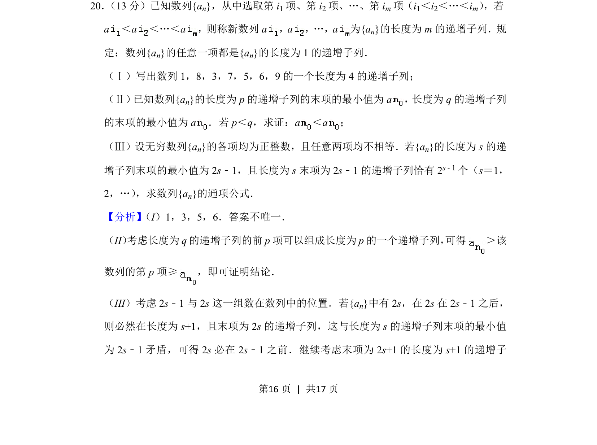
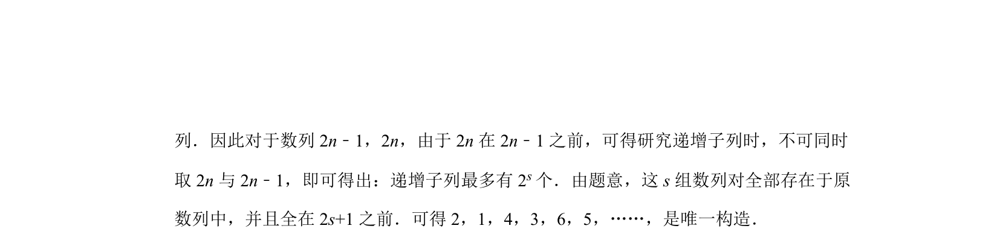
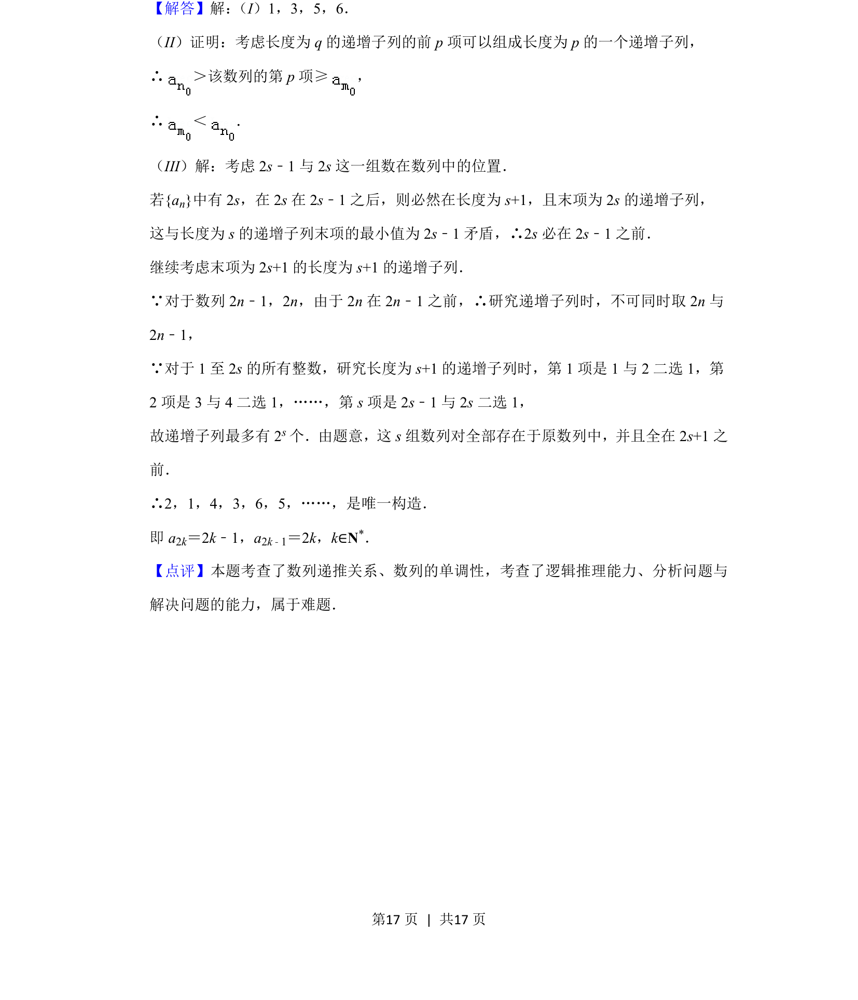

## 题面

## 摘要

考查递增子列的概念、性质证明及通项公式求解

## 关联考点

- [[381-数列概念-高中|数列]]
- [[递增子列]]
- [[625-不等式证明|不等式证明]]
- [[384-数列通项公式|通项公式]]

## 答案与解析

> 📄 原 PDF 第 16 页：`素材/真题/北京/2008-2024·（北京）数学高考真题/2019年高考数学试卷（理）（北京）（解析卷）.pdf`
