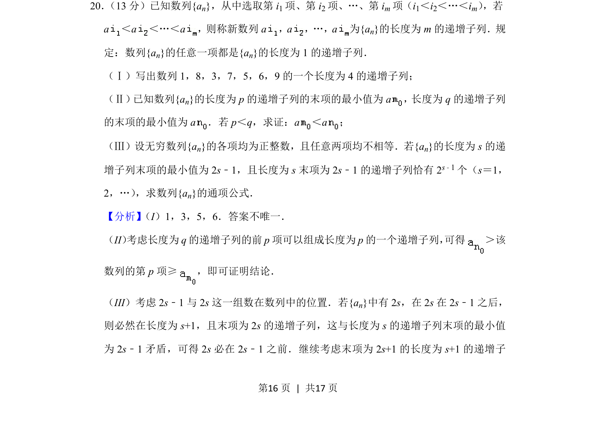
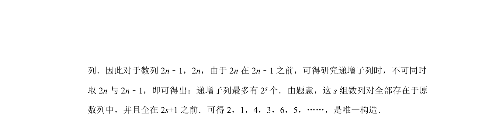
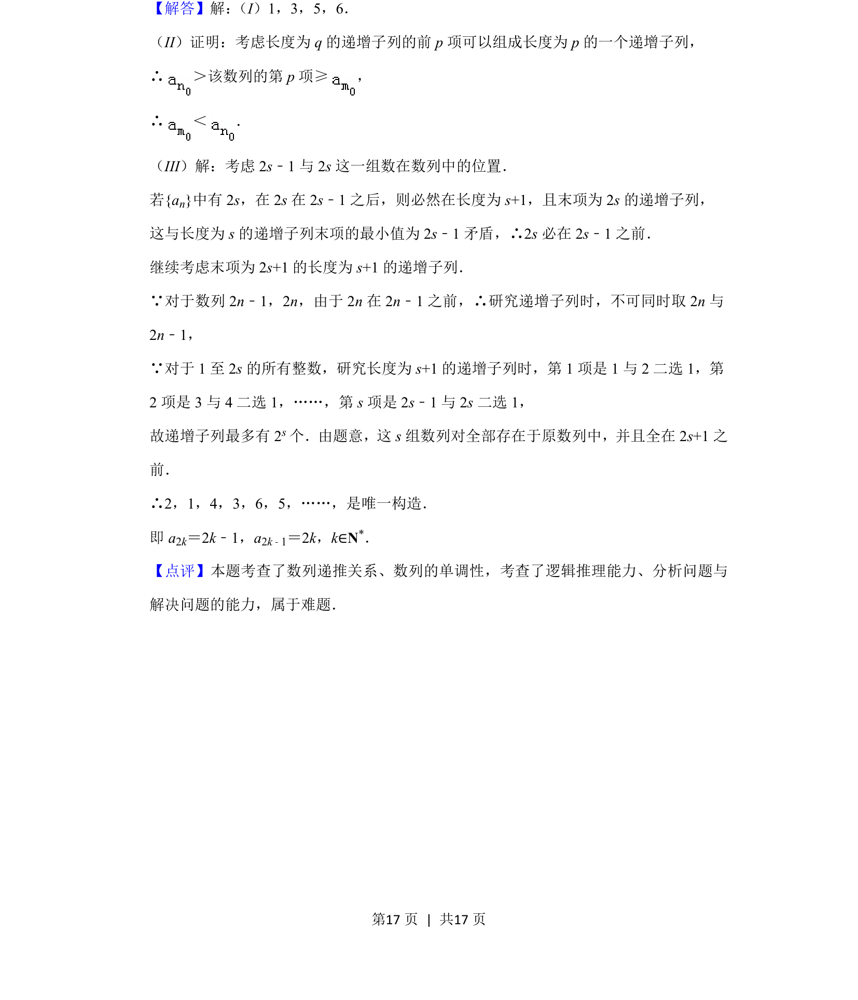

## 题面

## 摘要

考查递增子列的概念、性质证明及通项公式求解

## 关联考点

- [[381-数列概念-高中|数列]]
- [[递增子列]]
- [[624-不等式的证明|不等式证明]]
- [[384-数列通项公式|通项公式]]

## 答案与解析

> 📄 原 PDF 第 16 页：`素材/真题/北京/2008-2024·（北京）数学高考真题/2019年高考数学试卷（理）（北京）（解析卷）.pdf`

<!-- 题干文本-start -->
## 题干文本
20． （13分）已知数列{an}，从中选取第i 1项、第i 2项、…、第i m项（i1＜i2＜…＜im） ，若
a＜a＜…＜a，则称新数列a，a，…，a为{a n}的长度为m的递增子列．规
定：数列{an}的任意一项都是{an}的长度为1的递增子列．
（Ⅰ）写出数列1，8，3，7，5，6，9的一个长度为4的递增子列；
（Ⅱ）已知数列{an}的长度为p的递增子列的末项的最小值为a，长度为q的递增子列
的末项的最小值为a．若p＜q，求证：a＜a；
（Ⅲ）设无穷数列{an}的各项均为正整数，且任意两项均不相等．若{an}的长度为s的递
增子列末项的最小值为2s﹣1，且长度为s末项为2s﹣1的递增子列恰有2 s﹣1个（s＝1，
2，…） ，求数列{an}的通项公式．
<!-- 题干文本-end -->

<!-- 解析文本-start -->
## 解析文本
【分析】 （I）1，3，5，6．答案不唯一．
（II） 考虑长度为q的递增子列的前p项可以组成长度为p的一个递增子列， 可得 ＞该
数列的第p项≥ ，即可证明结论．
（III）考虑2s﹣1与2s这一组数在数列中的位置．若{a n}中有2s，在2s在2s﹣1之后，
则必然在长度为s+1，且末项为2s的递增子列，这与长度为s的递增子列末项的最小值
为2s﹣1矛盾，可得2s必在2s﹣1之前．继续考虑末项为2s+1的长度为s+1的递增子
<!-- 解析文本-end -->
