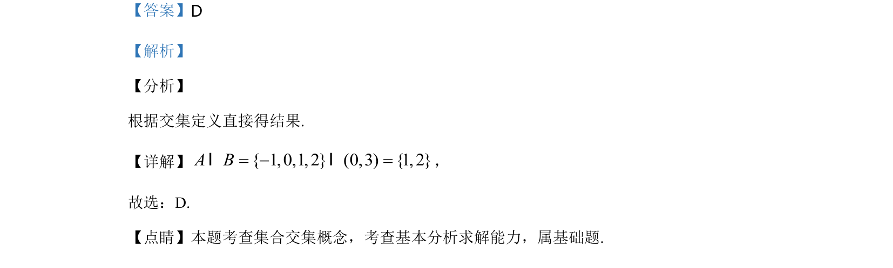

## 题面

## 摘要

考查集合交集运算，根据定义直接求解。

## 关联考点

- [[042-集合|集合]]
- [[1222-交集|交集]]
- [[793-基本运算|基本运算]]

## 答案与解析

> 📄 原 PDF 第 1 页：`素材/真题/北京/2008-2024·（北京）数学高考真题/2020年高考数学试卷（北京）（解析卷）.pdf`

<!-- 题干文本-start -->
## 题干文本
1.已知集合{ 1,0,1, 2}A= -，{ | 0 3}B x x= < <，则A B=I（    ）．
A. { 1,0,1 }-B. {0,1 }C. { 1,1, 2}-D. {1,2}
<!-- 题干文本-end -->

<!-- 解析文本-start -->
## 解析文本
【答案】D
【解析】
【分析】
根据交集定义直接得结果.
【详解】{ 1,0,1, 2} (0,3) { 1, 2}A B= - =I I，
故选：D.
【点睛】本题考查集合交集概念，考查基本分析求解能力，属基础题.
<!-- 解析文本-end -->
